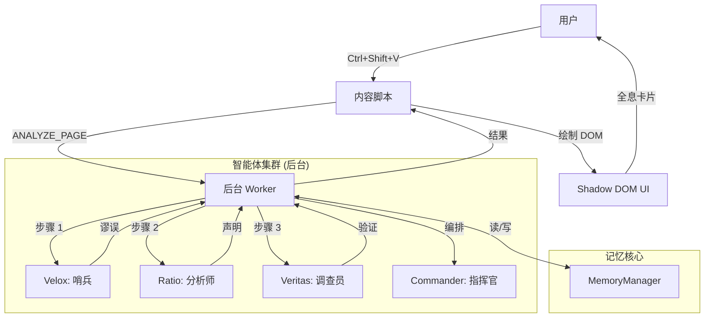

# Project VERITAS: 数字真理透镜 (The Digital Truth Lens)
> *Veritas vincit omnia.* (真理战胜一切。)

**Project VERITAS** 是一个“数字粗野主义”风格的浏览器扩展，旨在恢复网络的信任和清晰度。它利用专门的 AI 智能体集群实时分析内容，检测逻辑谬误，提取事实声明，通过网络验证信息，并可视化隐藏的知识结构。

本指南是 Project VERITAS 的权威手册，涵盖了从基础安装到高级自主智能体编排及深层内部机制的所有内容。

---

## 🏗️ 哲学与设计 (Philosophy & Design)

### 数字粗野主义 (Digital Brutalism)
Veritas 摒弃了现代网页设计中“干净的企业化”美学。它拥抱 **数字粗野主义**：
*   **原始数据 (Raw Data)**：信息不加修饰地呈现。
*   **高对比度 (High Contrast)**：霓虹青 (#00F0FF) 和金色 (#FFD700) 对比深邃的虚空黑 (#050505)。
*   **等宽排版 (Monospace Typography)**：使用 `JetBrains Mono` 字体以强调代码般的精确性。
*   **功能至上 (Function over Form)**：每一个像素都为揭示真理而存在。

### “真理透镜”概念 (The "Truth Lens" Concept)
网络充满了噪音、操纵和隐藏的议程。Veritas 就像一个透镜，将其过滤掉：
*   **压制噪音 (Dimming the Noise)**：视觉上抑制广告和低价值内容。
*   **高亮信号 (Highlighting the Signal)**：照亮事实和谬误。
*   **连接点滴 (Connecting the Dots)**：将孤立的声明编织成知识图谱。

### “霓虹仪式” (视觉机制) (The "Neon Ritual")
Veritas 的激活被设计成一种仪式感。
*   **光环 (The Halo)**：激活时，`NeonHalo` 组件会在全屏 Canvas 上渲染一个呼吸的青金渐变边框 (`src/components/NeonHalo.tsx`)。
*   **扫描线 (The Scanlines)**：细微的扫描线（不透明度 0.05）覆盖屏幕，唤起 CRT 显示器和赛博朋克美学。
*   **呼吸 (The Breathing)**：光晕强度使用正弦波函数 (`0.5 + Math.sin(phase) * 0.3`) 振荡，营造出系统是“活的”的感觉。

---

## ⚙️ 安装与设置 (Installation & Setup)

### 先决条件 (Prerequisites)
*   **Node.js**: v18 或更高版本。
*   **pnpm**: 推荐的包管理器 (或 npm/yarn)。
*   **Google Gemini API Key**: 智能体智力所需。

### 快速开始 (Quick Start)
1.  **克隆仓库**:
    ```bash
    git clone https://github.com/your-repo/project-veritas.git
    cd project-veritas
    ```

2.  **安装依赖**:
    ```bash
    pnpm install
    ```

3.  **配置环境**:
    在根目录创建一个 `.env` 文件：
    ```env
    PLASMO_PUBLIC_GEMINI_API_KEY=your_api_key_here
    ```

4.  **运行开发服务器**:
    ```bash
    pnpm dev
    ```
    这将启动 Plasmo 开发服务器，并自动将扩展加载到 Chrome 中（如果已配置），或者生成一个 `build/chrome-mv3-dev` 文件夹以供手动加载。

5.  **在 Chrome 中加载**:
    *   前往 `chrome://extensions`。
    *   启用“开发者模式” (Developer Mode)。
    *   点击“加载已解压的扩展程序” (Load Unpacked)。
    *   选择 `build/chrome-mv3-dev` 文件夹。

---

## 🚀 基础用法：真理扫描 (The "Truth Scan")

### 1. 激活系统
导航到任何你希望分析的文章、新闻帖子或社交媒体动态。
*   **触发**: 按下 `Ctrl + Shift + V` (Mac 上为 `Cmd + Shift + V`)。
*   **视觉反馈**: **霓虹光环**——一个呼吸的青/金边框——将出现在屏幕周围。这表明智能体集群已激活。

### 2. 分析流水线 (你所看到的)
Veritas 在三个可见层面上处理页面：

*   **第 1 层：哨兵 (Velox)**
    *   *效果*: 随着“低价值”内容（广告、侧边栏）变暗，页面可能会稍微变暗。
    *   *高亮*: 逻辑谬误周围出现 **蓝色** 轮廓。
    *   *含义*: 系统正在标记操纵企图和噪音。

*   **第 2 层：分析师 (Ratio)**
    *   *效果*: 特定的句子和短语被下划线标记。
    *   *高亮*: 事实声明显示 **青色** 下划线。
    *   *含义*: 系统已从文本中提取了可验证的事实。

*   **第 3 层：调查员 (Veritas)**
    *   *效果*: 青色下划线根据验证结果改变颜色。
    *   *高亮*:
        *   **绿色**: 已验证事实 (由多个来源支持)。
        *   **红色删除线**: 虚假/已揭穿声明 (被来源反驳)。
        *   **黄色/橙色**: 有争议或未验证 (证据混合)。

### 3. 与结果交互
点击 *任何* 高亮元素以打开 **增强全息卡片 (Enhanced Holographic Card)**。
*   **概览标签 (Overview Tab)**: 查看“风险评分” (0-100) 和摘要。
*   **谬误标签 (Fallacies Tab)**: 阅读关于论点 *为何* 存在缺陷的详细解释 (例如，“这是一个 *人身攻击*，因为...”)。
*   **验证标签 (Verification Tab)**: 查看证据。Veritas 列出它找到的来源、它们的可信度以及置信度分数。
*   **图谱标签 (Graph Tab)**: 局部知识图谱的迷你视图。

---

## 🧠 智能体集群：完整能力 (The Agent Swarm: Full Capabilities)

Veritas 不是单一的 AI；它是一个由四个专门智能体组成的协调集群。

### 🛡️ VELOX (哨兵 - The Sentry)
*   **模型**: Gemini 2.5 Flash-Lite (针对速度优化)。
*   **角色**: 第一道防线。
*   **核心指令**: “对操纵零容忍。”
*   **能力**:
    *   **噪音过滤**: 识别广告、导航和样板文件。
    *   **谬误检测**: 识别 12 种以上的谬误，包括 *稻草人谬误*、*煤气灯效应*、*诉诸伪善* 和 *错误对等*。
    *   **情感严重性分级**: 为情感操纵分配严重性评分 (低/中/高)。

### ⚖️ RATIO (分析师 - The Analyst)
*   **模型**: Gemini 2.5 Flash (针对精度优化)。
*   **角色**: 结构化思考者。
*   **核心指令**: “提取，不评判。”
*   **能力**:
    *   **事实提取**: 区分客观声明和主观意见。
    *   **实体链接**: 识别人物、组织、地点和事件。
    *   **时间提取**: 理解时间上下文 (例如，“去年”，“2020年”)。
    *   **多语言处理**: 可以处理中文、英文、西班牙文等，同时保留原始语言以保证搜索准确性。

### 🔍 VERITAS (调查员 - The Investigator)
*   **模型**: Gemini 2.5 Flash + Google Search Grounding。
*   **角色**: 真理探索者。
*   **核心指令**: “信任，但要验证。”
*   **能力**:
    *   **实时网络验证**: 实时查询 Google 搜索。
    *   **来源可信度分析**: 基于域权威性评估来源 (政府/教育 > 主流媒体 > 博客)。
    *   **反背诵协议**: 严禁复制搜索片段；必须综合答案。
    *   **图谱构建**: 为知识图谱构建节点 (声明、实体) 和边 (支持、反驳)。

### 💬 COMMANDER (指挥官 - The Hub)
*   **模型**: Gemini 2.5 Flash。
*   **角色**: 编排者和用户界面。
*   **核心指令**: “服务用户，保护真理。”
*   **能力**:
    *   **认知协议**: 确定用户请求是需要简单回答、工具调用还是复杂的多步骤计划。
    *   **自主执行**: 可以循环执行“思考 -> 行动 -> 观察”周期来解决复杂问题。
    *   **DOM 控制**: 可以滚动、高亮和操作页面以向你展示结果。
    *   **记忆**: 记住当前页面的上下文和你的对话。

---

## ⚡ 高级用法与“惊艳功能” (Advanced Usage & "Amazing Things")

本节详细介绍高级用户功能和系统的“魔法”能力。

### 1. 自主研究链 (“智能体循环”) (Autonomous Research Chains)
Commander 不仅仅是一个聊天机器人；它是一个可以 *做事* 的智能体。你可以给它需要多个步骤的复杂指令。

*   **触发**: `Ctrl + Shift + C` -> 输入命令。
*   **示例命令**: *“找出本页关于‘核能’的所有声明，验证它们，然后总结三个最大的误解。”*
*   **发生过程 (链条)**:
    1.  **计划**: Commander 将其分解为：`阅读页面` -> `提取声明 (主题: 核能)` -> `验证声明` -> `综合报告`。
    2.  **行动 1**: 调用 `read_page` 工具。
    3.  **行动 2**: 调用 `ratio` 智能体提取特定声明。
    4.  **行动 3**: 调用 `veritas` 智能体处理前 5 个声明。
    5.  **行动 4**: 分析验证结果以找出“虚假”或“误导性”的内容。
    6.  **输出**: 在聊天窗口中呈现最终报告。

### 2. 跨语言取证 (Cross-Lingual Forensics)
Veritas 擅长跨越语言障碍寻找真相。

*   **场景**: 你正在阅读一篇 **中文** 的本地新闻报道，声称某个特定事件发生在 **伦敦**。
*   **命令**: *“使用英文来源验证此事件。”*
*   **魔法**:
    *   Ratio 提取中文声明。
    *   Veritas 将核心查询翻译成英文。
    *   Veritas 搜索英国来源 (BBC, Guardian)。
    *   Veritas 比较事实并用中文（或你的首选语言）报告，高亮本地报道与基本事实之间的任何差异。

### 3. “废话探测器” (视觉谬误映射) (The "Bullshit Detector")
你无需阅读任何文字即可直观地评估作者的可信度。

*   **行动**: 运行扫描 (`Ctrl+Shift+V`)。
*   **观察**: 打开 **全屏图谱** (`Card -> Graph -> Fullscreen`)。
*   **技巧**: 寻找 **“谬误集群”**。
    *   如果你看到密集的 *蓝色* 节点 (谬误) 连接到一个特定的 *实体* (例如，一位政治家)，这直观地揭示了有针对性的抹黑活动。
    *   如果图谱是不连贯且稀疏的，说明论点薄弱且缺乏结构。
    *   如果图谱有强大的 *绿色* (已验证) 骨干，说明论点是坚实的。

### 4. “深度挖掘”选择 ("Deep Dive" Selection)
有时自动扫描会遗漏细微的细节。你可以强制智能体聚焦。

*   **行动**: 高亮特定段落 -> 右键点击 -> **"Veritas: Deep Dive"**。
*   **魔法**: 这将触发聚焦的、高强度的分析。Veritas 将针对 *仅该段落* 执行多次搜索查询，以比全页扫描高得多的审查力度交叉引用日期、名称和数字。

### 5. “认知协议” (指挥官模式) (The "Cognitive Protocol")
Commander 根据你的意图改变其行为。你可以通过措辞触发这些模式：

*   **直接执行模式**: *“用红色高亮所有提到‘Elon Musk’的地方。”* -> Commander 立即调用 DOM 工具。
*   **分析模式**: *“这篇文章有偏见吗？”* -> Commander 阅读文本并执行情感/谬误分析。
*   **创造模式**: *“将这段话改写为中立的。”* -> Commander 使用提取的事实重构文本，去除谬误。

### 6. 智能体任务重置与修正 (Agent Retasking & Correction)
如果智能体犯错或卡住，你可以纠正它们。

*   **场景**: Commander 未能找到特定声明。
*   **命令**: *“你漏掉了第二段关于预算的声明。专门再看一遍那部分。”*
*   **机制**: Commander 将其作为历史记录中的“系统错误”或“用户修正”接收。它将重新计划，可能会再次调用 `get_page_text` 或以更窄的焦点调用 `extract_claims`。
*   **大招**: *“忘掉之前的分析。重新开始，重点关注‘经济影响’。”* -> 这会强制重置智能体计划循环中的上下文。

---

## 🔬 深度挖掘：神经架构 (Deep Dive: The Neural Architecture)

本节解释使 Veritas 能够“思考”的内部机制。

### 1. 双层记忆系统 (`memory.ts`)
Veritas 使用复杂的记忆架构来处理 LLM 有限的上下文窗口，同时保持数据保真度。

*   **问题**: 为每个决策将网页全文 + 50 个提取的声明 + 20 个搜索结果发送给 LLM 会导致浏览器崩溃或花费巨资。
*   **解决方案**: **压缩 vs. 检索**。
    *   **层 A: 上下文索引 (压缩版)**:
        *   当智能体完成任务 (例如 `extract_claims`) 时，它会在活动上下文中存储一个 *摘要*。
        *   *示例*: “找到 15 个声明。前 3 个: [声明 A], [声明 B], [声明 C]。”
        *   Commander 查看此摘要以做出决策 (“好的，我应该验证声明 A”)。
    *   **层 B: 深度存储 (原始版)**:
        *   *完整* 的 JSON 对象 (包含 XPath、Element ID 和每一个单词) 存储在 `MemoryManager` 中，但对 LLM 的直接视野 *隐藏*。
    *   **桥梁**: 当 Commander 决定行动 (例如 “高亮声明 A”) 时，它调用 `read_memory` 工具。该工具从深度存储中获取 *原始* 数据，允许 Commander 访问绘制 DOM 所需的特定 `elementId`。

### 2. 自主执行循环 (`autonomous-executor.ts`)
Commander 运行在“ReAct” (推理 + 行动) 循环上，但有一个转折：**异步 DOM 绑定**。

*   **周期**:
    1.  **观察**: Commander 阅读 `state.history` 和 `memory.getExecutionContext()`。
    2.  **思考**: 它制定一个计划 (例如 “我需要搜索 X”)。
    3.  **行动**: 它发出一个 `toolCall` (例如 `search("X")`)。
    4.  **等待**: `AutonomousExecutor` 暂停 Commander。它执行工具 (可能涉及异步网络调用或 DOM 抓取)。
    5.  **反馈**: 结果被反馈到 `state.history`.
    6.  **循环**: Commander 醒来，看到结果，并决定下一步。
*   **安全**: 循环有 20 次迭代的硬性限制，以防止无限的“思维螺旋”。

### 3. “反背诵”协议 (The "Anti-Recitation" Protocol)
为了防止 AI 简单地复制搜索结果 (这会导致版权问题和幻觉)，Veritas 在 `veritas.ts` 和 `search.ts` 中强制执行严格的协议。

*   **机制**:
    *   提示词明确禁止“逐字背诵”。
    *   如果 Google Gemini API 检测到背诵，它会抛出一个特定的错误代码。
    *   **自动重试**: 系统捕获此错误并用更严格的“重写/综合”提示重新提示模型：*“你触发了背诵过滤器。重写你的答案以综合信息，而不是复制它。”*

### 4. 5层模糊匹配引擎 (`fuzzy-text-matcher.ts`)
网络是动态的。你 5 秒前分析的文本可能移动了 2 个像素或更改了 CSS 类。Veritas 使用稳健的 5 层策略来确保高亮以 100% 的准确率“粘附”。

*   **策略 1: 精确匹配**: 快速且完美。
*   **策略 2: 归一化精确匹配**: 忽略空白和特殊引号字符。
*   **策略 3: 最佳子串匹配**: 如果文本被部分编辑，使用滑动窗口查找最佳匹配块。
*   **策略 4: 部分 N-Gram 匹配**: 将文本分解为 15 个字符的块，并在段落中查找分散的它们。
*   **策略 5: 锚点匹配**: 查找句子的首尾单词并高亮中间的所有内容。

### 5. “海洋”数据协议 (`agents.ts`)
智能体使用严格的、类型化的 JSON 模式进行通信以确保可靠性。

*   **Velox 输出 (`RawAnalysisMap`)**:
    *   `lowValueNodes`: 带有 `elementId` 的广告/噪音列表。
    *   `fallacyNodes`: 带有 `severity` (低/中/高) 和 `explanation` 的逻辑错误列表。
*   **Ratio 输出 (`FactJSON`)**:
    *   `claims`: 核心单元。包含 `text`、`importance` (0-1) 和 `entities` (链接 ID)。
    *   `entities`: 带有 `mentions` (XPath) 的人物/组织。
*   **Veritas 输出 (`VerifiedGraphData`)**:
    *   `verifications`: 状态 (`verified`, `false`, `disputed`)、`confidence` 和 `evidence` (来源)。
    *   `graph`: 用于可视化的节点和边。

---

## 🛠️ 技术架构 (Technical Architecture)

### 系统图表 (System Diagram)


### 数据流流水线 (Data Flow Pipeline)
1.  **提取**: `content-extractor.ts` 抓取 DOM，创建一个简化的节点树以节省 Token。
2.  **分析**: 后台的 `AutonomousExecutor` 管理智能体链。它确保 Ratio 等待 Velox，Veritas 等待 Ratio。
3.  **存储**: 结果存储在 `MemoryManager` (`src/lib/memory.ts`) 中，它使用压缩来保持上下文窗口高效。
4.  **绘制**: `dom-painter.ts` 接收数据。它使用 **模糊 XPath 匹配** (`xpath-utils.ts`) 来查找要高亮的正确元素，即使页面自提取以来略有变化。

### 文件结构 (File Structure)
```
src/
├── agents/             # AI 大脑
│   ├── velox.ts        # 哨兵 (谬误)
│   ├── ratio.ts        # 分析师 (声明)
│   ├── veritas.ts      # 调查员 (验证)
│   ├── commander.ts    # 编排者 (聊天/计划)
│   └── search.ts       # 通用搜索工具
├── background/         # Service Worker
│   └── index.ts        # 消息路由与流水线控制
├── components/         # React UI 组件
│   ├── EnhancedHolographicCard.tsx
│   ├── FullscreenGraphModal.tsx
│   ├── CommanderPanel.tsx
│   └── ...
├── contents/           # 内容脚本
│   └── cursor.tsx      # 主注入脚本
├── lib/                # 工具库
│   ├── autonomous-executor.ts # 智能体循环引擎
│   ├── memory.ts       # 上下文管理
│   ├── dom-painter.ts  # 视觉操作
│   └── ...
└── store/              # 状态管理 (Zustand)
```

---

## 🔧 故障排除与错误处理 (Troubleshooting & Error Handling)

### 常见问题 (Common Issues)

#### 1. "API Key Missing" 或 "Quota Exceeded"
*   **症状**: 霓虹光环出现但立即变红或消失。控制台显示 403/401 错误。
*   **修复**: 检查你的 `.env` 文件。确保 `PLASMO_PUBLIC_GEMINI_API_KEY` 已设置。如果使用的是 Gemini 免费层，你可能达到了速率限制 (RPM)。等待一分钟再试。

#### 2. "RECITATION" 错误 (安全阻断)
*   **症状**: Veritas 无法验证声明，日志显示 `Finish Reason: RECITATION`。
*   **原因**: AI 试图逐字复制搜索结果，触发了 Google 的反抄袭过滤器。
*   **系统响应**: 系统设计用于捕获此错误。它将自动使用更严格的“重写/综合”提示重试。如果两次失败，它会将声明标记为“无法验证 (安全阻断)”。

#### 3. "Element Not Found" / 高亮未出现
*   **症状**: 分析完成 (状态: "Complete")，但文本上没有出现高亮。
*   **原因**: 网页使用了高度动态的框架 (如 React/Vue)，在 Veritas 提取文本 *之后* 重新渲染了 DOM。
*   **修复**:
    *   Veritas 使用 **模糊匹配**，所以它容忍 *一些* 变化。
    *   如果完全失败，尝试将相关文本滚动到视野中并再次运行扫描。
    *   对特定文本使用 **深度挖掘** 功能，因为这会抓取 DOM 的新鲜快照。

#### 4. 扩展连接丢失
*   **症状**: 控制台中显示 "Extension context invalidated"。
*   **原因**: 扩展在页面打开时被更新或重新加载。
*   **修复**: 刷新网页。内容脚本需要重新注入。

### 调试模式 (Debugging Mode)
要确切查看智能体在想什么：
1.  打开 Chrome 开发者工具 (`F12`)。
2.  转到 **Console** 标签。
3.  过滤 `[VERITAS]` 或 `[COMMANDER]`。
4.  你将看到原始的“思维”链：
    *   `[COMMANDER] Plan: Read -> Verify -> Report`
    *   `[VELOX] Detected Fallacy: Ad Hominem (Confidence: High)`

---

## 📜 许可与致谢 (License & Credits)
Project VERITAS 是开源软件。
*   **核心**: Plasmo + React + TypeScript。
*   **智力**: Google Gemini 2.5。
*   **可视化**: React Force Graph。

> *In a world of noise, be the signal.* (在喧嚣的世界中，做那个信号。)

---

# 第二部分：原子机制 (THE ATOMIC MECHANICS)
> *对内部认知架构和物理引擎的详细分析。*

本节面向希望了解机器“灵魂”的开发者和高级用户。

## 🧠 认知架构 (提示词) (Cognitive Architectures)

Veritas 的智能不仅在于模型，还在于管理它们的 **系统提示词**。这些提示词充当每个智能体的“认知操作系统”。

### 1. RATIO: 熵减器 (The Entropy Reducer)
Ratio 被设计为“精密仪器”。其提示词 (`src/agents/ratio.ts`) 强制执行三个关键协议：

*   **协议 A: “提取，不评判”**
    *   *指令*: “你的唯一工作是提取声明，而不是评估其真实性。”
    *   *推理*: 如果 Ratio 过滤掉“虚假”声明，Veritas 就永远没有机会揭穿它们。Ratio 必须通过 *一切* 看起来像声明的内容，即使是“月亮是用奶酪做的”，以便 Veritas 可以将其标记为 **FALSE**。
*   **协议 B: 语言保留**
    *   *指令*: “如果输入是中文，输出中文。如果是英文，输出英文。”
    *   *推理*: 在验证 *之前* 翻译声明会破坏搜索关键词。要验证中文新闻报道，我们必须搜索原始中文短语。
*   **协议 C: 严格 JSON 强制**
    *   *指令*: “最多 15 个声明。最多 15 个实体。”
    *   *推理*: 防止上下文溢出并确保智能体优先考虑最重要的事实 (“熵减”)。

### 2. VERITAS: 仲裁者 (The Arbiter)
Veritas 是“法官”。其架构 (`src/agents/veritas.ts`) 建立在 **搜索增强 (Search Grounding)** 和 **反背诵 (Anti-Recitation)** 之上。

*   **协议 A: “反背诵”防火墙**
    *   *问题*: LLM 喜欢复制粘贴搜索结果，这会触发 Google 的“背诵”安全过滤器，阻止响应。
    *   *解决方案*: 提示词明确命令：*“阅读搜索结果，理解事实，然后完全用你自己的话写出答案。”*
    *   *回退*: 如果 API 返回 `FinishReason: RECITATION`，系统捕获错误并使用更严格的“重写”提示自动重试。
*   **协议 B: 位置 ID 映射**
    *   *问题*: LLM 经常忘记复杂的 ID (例如 `claim-12`) 并返回通用的 ID (`claim-1`)。
    *   *解决方案*: 代码使用 **3阶段映射策略**:
        1.  **精确匹配**: 检查返回的 ID 是否存在。
        2.  **位置匹配**: 假设第 1 个验证对应于发送的第 1 个声明。
        3.  **模糊文本匹配**: 将验证文本与原始声明进行比较。
*   **协议 C: 直接验证**
    *   *优化*: 如果声明是基本科学事实 (“水是 H2O”)，Veritas 被指示跳过网络搜索并直接以 `Confidence: 1.0` 进行验证。

---

## 🌐 突触网络 (全局状态) (The Synaptic Web)

Veritas 使用构建在 **Zustand** 和 **Chrome Storage** (`src/store/index.ts`) 之上的“中枢神经系统”。

### 1. 跨上下文同步
扩展运行在三个独立的世界中：
1.  **内容脚本** (网页)
2.  **侧边栏** (UI)
3.  **后台 Worker** (大脑)

为了保持它们同步，存储使用 **桥接模式**:
*   **写入**: 当你更新状态 (例如 `setHaloActive(true)`) 时，它保存到 `chrome.storage.local`。
*   **监听**: 所有上下文监听 `chrome.storage.onChanged`。
*   **同步**: 当存储更改时，其他上下文自动更新其本地 Zustand 存储。这创造了单一、统一应用程序的错觉。

### 2. “强制停止”断路器
如果智能体陷入循环，用户可以点击“停止”。这会触发硬杀伤：
*   **行动**: `forceStop()`
*   **效果**:
    1.  立即清除 UI 状态。
    2.  向后台 Worker 发送 `FORCE_STOP` 消息。
    3.  `AutonomousExecutor` 在每一步之前检查此标志，如果设置则立即中止执行。

---

## ⚛️ 全息 UI 物理 (Holographic UI Physics)

界面不仅仅是“样式化”的；它是 **模拟** 的。

### 1. “霓虹仪式” (呼吸数学)
`NeonHalo` 组件 (`src/components/NeonHalo.tsx`) 使用正弦波实时计算不透明度 (60fps):
```typescript
const opacity = 0.5 + Math.sin(Date.now() / 1000) * 0.3;
```
这创造了一种感觉有机的“呼吸”效果，暗示 AI 是“活的”并且在思考。

### 2. 风险仪表
全息卡片 (`EnhancedHolographicCard.tsx`) 上的圆形仪表使用 SVG 数学绘制：
*   **周长**: `2 * PI * r`
*   **Dash Offset**: `circumference - (score / 100) * circumference`
这允许仪表从 0 平滑动画到计算出的风险评分。

### 3. 故障效果
为了增强“数字粗野主义”美学，卡片有一个随机故障触发器：
*   **逻辑**: 每 10 秒，有 30% 的几率触发 300ms 的 CSS `glitch` 动画。
*   **效果**: 卡片瞬间扭曲，模拟信号干扰或“赛博朋克”数据流。

---

## 🛡️ 弹性协议 (自愈代码) (Resilience Protocols)

Veritas 假设 AI 会失败。系统构建为自动恢复。

### 1. 4阶段 JSON 恢复 (`json-parser.ts`)
LLM 经常输出损坏的 JSON。Veritas 使用自定义解析器尝试分四个阶段修复它：
1.  **直接解析**: 尝试 `JSON.parse()`。
2.  **清理解析**: 去除 Markdown 代码栅栏 (` ```json `)。
3.  **高级恢复**: 修复常见语法错误 (例如，未转义的引号，尾随逗号)。
4.  **截断恢复**: 如果 Token 限制切断了响应，解析器跟踪括号深度 (`{` vs `}`) 以找到最后一个有效的完整对象并丢弃损坏的尾部。

### 2. “模拟数据”电路
如果 API 完全失败 (超时, 500 错误, 配额超限)，智能体不会崩溃。
*   **机制**: 每个智能体都有一个 `getMockData()` 回退函数。
*   **结果**: UI 继续使用占位符数据运行，允许用户即使在大脑离线时也能检查界面。

---

# 第三部分：指挥官手册 (PART III: THE COMMANDER'S HANDBOOK)
> *如何驾驶机器。自主引擎的手册。*

Commander 不是聊天机器人。它是一个 **控制论编排者 (Cybernetic Orchestrator)**，将其他智能体作为工具使用。要有效地使用它，你必须理解它的“认知协议”。

## 🗣️ 命令的语法 (The Syntax of Command)

Commander 将你的请求分为三种类型 (`src/agents/commander.ts`)。了解这一点有助于你获得想要的结果。

### 类型 A: 直接执行 (“士兵”模式)
*   **意图**: 你希望立即运行特定工具。
*   **触发短语**: “高亮...”，“显示...”，“列出...”，“阅读...”
*   **示例**: *“用红色高亮所有谬误。”*
*   **系统响应**: Commander 跳过计划阶段，立即调用 `analyze_fallacies` -> `highlight_element`。
*   **最适合**: 快速视觉反馈。

### 类型 B: 目标导向 (“将军”模式)
*   **意图**: 你有一个高层目标，但不关心如何完成。
*   **触发短语**: “验证...”，“调查...”，“这是真的吗？”，“分析...”
*   **示例**: *“关于预算赤字的声明是真的吗？”*
*   **系统响应**: Commander 进入 **自主模式**。
    1.  **计划**: “我需要先找到声明。” -> `extract_claims`
    2.  **细化**: “找到 3 个关于预算的声明。我将验证特定的一个。” -> `deep_dive`
    3.  **报告**: “根据财政部数据，该声明为假。” -> `show_result_window`
*   **最适合**: 复杂研究任务。

### 类型 C: 上下文 (“伙伴”模式)
*   **意图**: 你指的是屏幕上或之前聊天中的某事。
*   **触发短语**: “那个怎么样？”，“为什么它是假的？”，“深入挖掘。”
*   **示例**: (扫描后) *“为什么第二个声明被标记为假？”*
*   **系统响应**: Commander 阅读 `Memory Index`，检索“声明 #2”的特定 `verification` 结果，并解释推理。

## 🛠️ 工具带 (用户版) (The Toolbelt)

Commander 可以访问专门的武库。你可以通过名称或意图调用这些。

| 工具 | 触发器 | 描述 |
| :--- | :--- | :--- |
| **Deep Dive (深度挖掘)** | “验证这个”，“检查来源” | 触发 Veritas 对特定文本执行多查询 Google 搜索。 |
| **Fallacy Scan (谬误扫描)** | “查找逻辑错误”，“这有偏见吗？” | 触发 Velox 扫描 12 种以上的逻辑谬误。 |
| **Claim Extraction (声明提取)** | “列出事实”，“关键点是什么？” | 触发 Ratio 提取原子声明和实体。 |
| **Highlight (高亮)** | “标记为红色”，“显示在哪里” | 使用 **模糊 XPath** 绘制 DOM。即使文本移动也 100% 准确。 |
| **Memory Read (记忆读取)** | “你发现了什么？”，“总结” | 访问先前智能体的隐藏 JSON 状态。 |

## ⚡ “上帝模式”工作流 ("God Mode" Workflows)

这些是利用集群全部力量的高级命令链。

### 1. “交叉盘问” (The "Cross-Examination")
*   **命令**: *“找出这篇文章与关于此主题的世卫组织官方报告之间的所有矛盾。”*
*   **链条**:
    1.  Commander 阅读页面。
    2.  提取关于健康/医疗主题的声明。
    3.  运行 `deep_dive`，查询特定为：`site:who.int [声明关键词]`。
    4.  综合一份报告，高亮文章偏离官方来源的地方。

### 2. “可视化器” (The "Visualizer")
*   **命令**: *“用红色高亮已验证的事实，用红色高亮谬误。”*
*   **链条**:
    1.  调用 `extract_claims` -> `verify_claims`。
    2.  调用 `analyze_fallacies`。
    3.  迭代结果：
        *   如果 `status === 'verified'`，调用 `highlight_claim(color: 'green')`。
        *   如果 `fallacy`，调用 `highlight_element(color: 'red')`。
    4.  页面转变为真理的热图。

### 3. “实体画像” (The "Entity Profiler")
*   **命令**: *“文中提到的‘John Doe’是谁，他可信吗？”*
*   **链条**:
    1.  调用 `extract_claims` 查找实体 "John Doe"。
    2.  运行背景调查搜索 (`"John Doe reputation credentials"`)。
    3.  返回一份总结其背景和潜在偏见的档案。

## 🎮 智能体任务重置 (修正) (Agent Retasking)

即使是集群也会犯错。你可以实时纠正它们。

*   **场景**: Commander 高亮了错误的段落。
*   **命令**: *“不，我指的是那一段下面的那段，关于减税的。”*
*   **机制**:
    1.  Commander 接收错误反馈。
    2.  它重新阅读 `get_page_text` 输出。
    3.  它在先前位置附近执行对“减税”的 **模糊文本匹配**。
    4.  它在正确的节点上重新执行高亮。

*   **场景**: Veritas 未能验证声明。
*   **命令**: *“尝试搜索‘2023 财政报告’代替。”*
*   **机制**:
    1.  Commander 手动触发带有 *用户提供* 查询的 `deep_dive`。
    2.  这覆盖了智能体的内部查询生成逻辑。

---

## 🛑 “自毁开关” (The "Kill Switch")

如果 Commander 陷入循环或者你想取消长时间的研究任务：
*   **行动**: 点击 Commander 面板中的 **"STOP"** 按钮。
*   **命令**: 输入 *“Stop”* 或 *“Cancel”*。
*   **效果**: `AutonomousExecutor` 立即终止循环 (`isRunning = false`)，清除任务队列，并将智能体状态重置为“空闲”。
