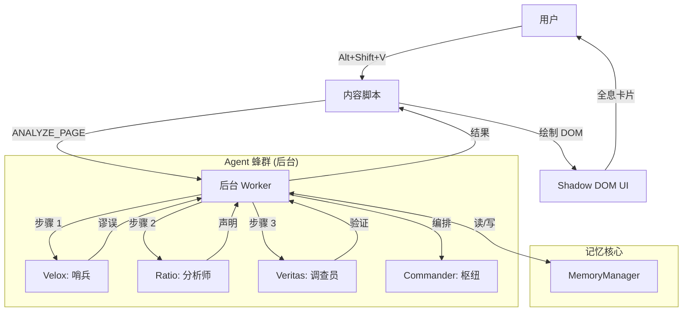

# Project VERITAS：数字真理透镜
> *Veritas vincit omnia.* (真理战胜一切。)

**Project VERITAS** 是一个“数字粗野主义”风格的浏览器扩展，旨在重建网络的信任与清晰度。它利用一个由专业 AI Agent 组成的蜂群来实时分析内容，检测逻辑谬误，提取事实声明，通过全网验证信息，并可视化知识的隐藏结构。

本指南是 Project VERITAS 的终极手册，涵盖了从基础安装到高级自主 Agent 编排及深度内部机制的所有内容。

---

## 🏗️ 哲学与设计

### 数字粗野主义 (Digital Brutalism)
Veritas 拒绝现代网页设计中那种“干净的企业风”美学。它拥抱 **数字粗野主义**：
*   **原始数据**：信息不加修饰地呈现。
*   **高对比度**：霓虹青 (#00F0FF) 和金色 (#FFD700) 对比深邃的虚空黑 (#050505)。
*   **等宽字体**：使用 `JetBrains Mono` 强调代码般的精确感。
*   **功能至上**：每一个像素都为揭示真理而生。

### “真理透镜”概念
网络充满了噪音、操纵和隐藏的议程。Veritas 就像一个透镜，过滤掉这些杂质：
*   **压制噪音**：广告和低价值内容在视觉上被抑制。
*   **高亮信号**：事实和谬误被照亮。
*   **连接点滴**：孤立的声明被编织成知识图谱。

### “霓虹仪式” (视觉机制)
Veritas 的激活被设计成一种仪式感。
*   **光环 (The Halo)**：激活时，`NeonHalo` 组件会在全屏 Canvas 上渲染一个呼吸般的青金渐变边框 (`src/components/NeonHalo.tsx`)。
*   **扫描线 (The Scanlines)**：微弱的扫描线（不透明度 0.05）覆盖屏幕，唤起 CRT 显示器和赛博朋克的美学。
*   **呼吸感 (The Breathing)**：光辉强度使用正弦波函数 (`0.5 + Math.sin(phase) * 0.3`) 振荡，营造出系统“活着”的感觉。

---

## ⚙️ 安装与设置

### 先决条件
*   **Node.js**: v18 或更高版本。
*   **pnpm**: 推荐的包管理器 (或 npm/yarn)。
*   **Google Gemini API Key**: Agent 智能的核心需求。

### 快速开始
1.  **克隆仓库**：
    ```bash
    git clone https://github.com/mqingcs/Project-VERITAS-The-Digital-Truth-Lens/tree/Final-version
    cd Project-VERITAS-The-Digital-Truth-Lens
    ```

2.  **安装依赖**：
    ```bash
    npm install
    ```

3.  **运行开发服务器**：
    ```bash
    npm run build
    ```
    这将启动 Plasmo 开发服务器，并自动将扩展加载到 Chrome 中（如果已配置），或者生成一个 `build/chrome-mv3-prod` 文件夹以供手动加载。

4.  **在 Chrome 中加载**：
    *   前往 `chrome://extensions`。
    *   启用“开发者模式”。
    *   点击“加载已解压的扩展程序”。
    *   选择 `build/chrome-mv3-prod` 文件夹。

**恭喜！** 你已经成功安装了 Project VERITAS。

---

## 🚀 基础用法：真理扫描

### 1. 激活系统
导航到任何你想要分析的文章、新闻帖子或社交媒体流。
*   **触发**：按下 `Alt + Shift + V`（Mac 上为 `option + Shift + V`）。
*   **视觉反馈**：**霓虹光环**——一个呼吸着的青/金边框——将出现在屏幕周围。这表明 Agent 蜂群已激活。

### 2. 分析流水线 (你所看到的)
Veritas 在三个可见层面上处理页面：

*   **第 1 层：哨兵 (Velox)**
    *   *效果*：页面可能会略微变暗，“低价值”内容（广告、侧边栏）被压暗。
    *   *高亮*：逻辑谬误周围出现 **蓝色** 轮廓。
    *   *含义*：系统正在标记操纵企图和噪音。

*   **第 2 层：分析师 (Ratio)**
    *   *效果*：特定的句子和短语被下划线标记。
    *   *高亮*：事实声明下方出现 **青色** 下划线。
    *   *含义*：系统已从文本中提取了可验证的事实。

*   **第 3 层：调查员 (Veritas)**
    *   *效果*：青色下划线根据验证结果改变颜色。
    *   *高亮*：
        *   **绿色**：已验证事实 (由多个来源支持)。
        *   **红色删除线**：虚假/被揭穿的声明 (被来源反驳)。
        *   **黄色/橙色**：有争议或未验证 (证据不一)。

### 3. 分析流水线 (你所看到的)

当你点击“ANALYZE”时，系统会对页面执行“深度扫描”。结果呈现在 **增强全息卡片 (Enhanced Holographic Card)** 中，这是一个可拖动、交互式的仪表盘，拥有 **6 个专用标签页**：

#### 标签页 1: OVERVIEW (总览仪表盘)
*   **风险仪表 (Risk Gauge)**：一个实时的、动画化的圆形仪表，显示“误导风险分” (0-100)。
    *   **绿色 (<30)**：安全。
    *   **黄色 (30-70)**：警告。
    *   **红色 (>70)**：高风险。
*   **执行摘要**：AI 生成的关于页面核心论点和可信度的简明摘要。
*   **快速操作**：一键按钮“询问 Commander”或“查看图谱”。
*   **状态徽章**：即时指示器，显示“虚假声明”、“检测到谬误”或“已验证事实”。

#### 标签页 2: FALLACIES (胡扯探测器)
*   **列表视图**：显示 Velox 检测到的每一个逻辑谬误。
*   **定义**：点击“What is this?”查看谬误的学术定义（例如，*人身攻击*、*稻草人谬误*）。
*   **严重性**：每个谬误根据其对论点的影响被评级（低/中/高）。

#### 标签页 3: CLAIMS (事实矩阵)
*   **原子提取**：列出 Ratio 分离出的每一个事实声明。
*   **重要性条**：视觉指示器，显示该声明对文章论点的核心程度。
*   **实体标签**：显示声明中提到的关键人物/组织（例如，“WHO”、“Elon Musk”）。
*   **“Verify This”**：一个手动触发按钮，强制对特定声明进行深度挖掘。

#### 标签页 4: VERIFICATION (真理透镜)
*   **状态指示器**：
    *   ✅ **VERIFIED (已验证)**：由可靠来源确认。
    *   ❌ **FALSE (虚假)**：被证据反驳。
    *   ⚠️ **DISPUTED (有争议)**：来源不一致。
*   **证据链**：显示判决背后的推理。
*   **来源引用**：直接链接到外部证据（gov, edu, org 等），按可信度颜色编码。

#### 标签页 5: GRAPH (迷你地图)
*   **预览**：当前分析的一个小型、交互式 2D 力导向图。
*   **过滤器**：切换显示/隐藏声明、实体或来源。
*   **全屏触发**：一个按钮，将图谱扩展为沉浸式的“上帝模式”视图。

#### 标签页 6: COMMANDER (聊天)
*   **上下文聊天**：一个专用的聊天窗口，预加载了你正在查看的 *特定* 卡片/元素的上下文。
*   **建议问题**：基于分析结果 AI 生成的后续问题（例如，*“John Doe 是谁？”*，*“解释滑坡谬误”*）。

---

## 🕸️ 知识图谱 (视觉智能)

Veritas 不仅仅阅读文本；它构建一个 **语义网络**。**全屏图谱模态框** (`FullscreenGraphModal.tsx`) 允许你在 3D 空间中探索这个网络。

### 核心机制
*   **节点**：
    *   🟡 **声明 (Claims)** (金色)：核心主张。
    *   🔵 **实体 (Entities)** (青色)：人物、组织、地点。
    *   🟢 **来源 (Sources)** (绿色)：外部 URL 和证据。
*   **边**：关系（例如，“支持”、“反驳”、“提及”）。
*   **物理引擎**：使用力导向算法 (`d3-force`)，相关节点相互吸引，无关节点相互排斥。

### 高级交互
*   **聚焦模式 (Focus Mode)**：双击任何节点以隔离它及其直接连接，使图谱的其余部分淡出。
*   **智能搜索 (Smart Search)**：在搜索栏中输入以立即高亮匹配的节点。使用 `<` 和 `>` 在匹配项之间循环。
*   **类型过滤 (Type Filtering)**：切换声明、实体或来源的可见性以减少噪音。
*   **可拖动画布**：平移和缩放以探索海量数据集。

---

## 🧠 Agent 蜂群：全能力概览

Veritas 不是单一的 AI；它是一个由四个专业 Agent 组成的协调蜂群。

### 🛡️ VELOX (哨兵)
*   **模型**: Gemini 2.5 Flash-Lite (为速度优化)。
*   **角色**: 第一道防线。
*   **核心指令**: “对操纵零容忍。”
*   **能力**:
    *   **噪音过滤**: 识别广告、导航和样板文件。
    *   **谬误检测**: 识别 12+ 种类型的谬误，包括 *稻草人*、*煤气灯效应*、*那又怎么说主义* 和 *错误等同*。
    *   **情绪严重性分级**: 对情绪操纵进行严重性评分（低/中/高）。

### ⚖️ RATIO (分析师)
*   **模型**: Gemini 2.5 Flash (为精确度优化)。
*   **角色**: 结构化思考者。
*   **核心指令**: “提取，不评判。”
*   **能力**:
    *   **事实提取**: 区分客观声明和主观意见。
    *   **实体链接**: 识别人物、组织、地点和事件。
    *   **时间提取**: 理解时间上下文（例如，“去年”，“2020年”）。
    *   **多语言处理**: 可以处理中文、英文、西班牙文等，同时保留原始语言以保证搜索准确性。

### 🔍 VERITAS (调查员)
*   **模型**: Gemini 2.5 Flash + Google Search Grounding。
*   **角色**: 真理探索者。
*   **核心指令**: “信任，但要验证。”
*   **能力**:
    *   **实时网络验证**: 实时查询 Google 搜索。
    *   **来源可信度分析**: 基于域名权威性评估来源 (Gov/Edu > 主流媒体 > 博客)。
    *   **反背诵协议**: 严禁复制搜索片段；必须综合生成答案。
    *   **图谱构建**: 为知识图谱构建节点（声明、实体）和边（支持、反驳）。

### 💬 COMMANDER (枢纽)
*   **模型**: Gemini 2.5 Flash。
*   **角色**: 编排者和用户界面。
*   **核心指令**: “服务用户，捍卫真理。”
*   **能力**:
    *   **认知协议**: 确定用户请求是需要简单回答、工具调用还是复杂的多步骤计划。
    *   **自主执行**: 可以循环执行“思考 -> 行动 -> 观察”周期来解决复杂问题。
    *   **DOM 控制**: 可以滚动、高亮和操纵页面以向你展示结果。
    *   **记忆**: 记住当前页面的上下文和你的对话。

---

## ⚡ 高级用法 & “令人惊叹的功能”

本节详细介绍了高级用户功能和系统的“魔法”能力。

### 1. 自主研究链 (The "Agent Loop")
Commander 不仅仅是一个聊天机器人；它是一个可以 *做事* 的 Agent。你可以给它需要多个步骤的复杂指令。

*   **触发**: `Alt + Shift + C` -> 输入指令。
*   **指令示例**: *“找出页面上关于‘核能’的所有声明，验证它们，然后总结三个最大的误解。”*
*   **发生了什么 (链条)**:
    1.  **计划**: Commander 分解任务：`阅读页面` -> `提取声明 (主题: 核能)` -> `验证声明` -> `综合报告`。
    2.  **行动 1**: 调用 `read_page` 工具。
    3.  **行动 2**: 调用 `ratio` Agent 提取特定声明。
    4.  **行动 3**: 调用 `veritas` Agent 验证前 5 个声明。
    5.  **行动 4**: 分析验证结果以找出“虚假”或“误导性”的内容。
    6.  **输出**: 在聊天窗口中呈现最终报告。

### 2. 跨语言取证
Veritas 擅长跨越语言障碍寻找真理。

*   **场景**: 你正在阅读一篇 **中文** 的本地新闻报道，声称 **伦敦** 发生了特定事件。
*   **指令**: *“使用英文来源验证此事件。”*
*   **魔法**:
    *   Ratio 提取中文声明。
    *   Veritas 将核心查询翻译成英文。
    *   Veritas 搜索英国来源 (BBC, Guardian)。
    *   Veritas 比较事实并用中文（或你的首选语言）回报，高亮本地报道与基本事实之间的任何差异。

### 3. “胡扯探测器” (视觉谬误映射)
你可以不用读一个字就直观地评估作者的可信度。

*   **行动**: 运行扫描 (`Alt+Shift+V`)。
*   **观察**: 打开 **全屏图谱** (`Card -> Graph -> Fullscreen`)。
*   **技巧**: 寻找 **“谬误簇”**。
    *   如果你看到密集的 *蓝色* 节点（谬误）网络连接到一个特定的 *实体*（例如，一位政治家），这直观地揭示了一场有针对性的抹黑运动。
    *   如果图谱是断开且稀疏的，说明论点薄弱且结构松散。
    *   如果图谱有强大的 *绿色*（已验证）骨干，说明论点扎实。

### 4. “深度挖掘”选择
有时自动扫描会遗漏细微的细节。你可以强制 Agent 聚焦。

*   **行动**: 高亮特定段落 -> 右键点击 -> **"Veritas: Deep Dive"**。
*   **魔法**: 这会触发一次聚焦的、高强度的分析。Veritas 将 *仅针对该段落* 执行多次搜索查询，比全页扫描更严格地交叉引用日期、姓名和数字。

### 5. “认知协议” (Commander 模式)
Commander 根据你的意图改变其行为。你可以通过措辞触发这些模式：

*   **直接执行模式**: *“用红色高亮所有提到‘Elon Musk’的地方。”* -> Commander 立即调用 DOM 工具。
*   **分析模式**: *“这篇文章有偏见吗？”* -> Commander 阅读文本并执行情感/谬误分析。
*   **创造模式**: *“将这段话重写为中立语气。”* -> Commander 使用提取的事实重构文本，去除谬误。

### 6. Agent 重任务化与修正 (Retasking)
如果 Agent 犯错或卡住，你可以纠正它们。

*   **场景**: Commander 未能找到特定声明。
*   **指令**: *“你漏掉了第二段关于预算的声明。专门再看一遍那个部分。”*
*   **机制**: Commander 在其历史记录中将其作为“系统错误”或“用户修正”接收。它将重新规划，可能会再次调用 `get_page_text` 或以更窄的焦点调用 `extract_claims`。
*   **大招**: *“忘掉之前的分析。以‘经济影响’为重点重新开始。”* -> 这会强制重置 Agent 规划循环中的上下文。

---

## 🔬 深度挖掘：神经架构

本节解释了让 Veritas “思考”的内部机制。

### 1. 双层记忆系统 (`memory.ts`)
Veritas 使用复杂的记忆架构来处理 LLM 有限的上下文窗口，同时保持数据保真度。

*   **问题**: 将网页全文 + 50 个提取的声明 + 20 个搜索结果发送给 LLM 进行每个决策会让浏览器崩溃或花费巨资。
*   **解决方案**: **压缩 vs. 检索**。
    *   **A 层：上下文索引 (压缩)**：
        *   当 Agent 完成任务（例如 `extract_claims`）时，它会在活动上下文中存储一个 *摘要*。
        *   *示例*：“找到 15 个声明。前 3 个：[声明 A], [声明 B], [声明 C]。”
        *   Commander 看到这个摘要来做决定（“好的，我应该验证声明 A”）。
    *   **B 层：深度存储 (原始)**：
        *   *完整* 的 JSON 对象（包含 XPath、Element ID 和每一个字）存储在 `MemoryManager` 中，但对 LLM 的直接视野 *隐藏*。
    *   **桥梁**：当 Commander 决定行动（例如“高亮声明 A”）时，它调用 `read_memory` 工具。该工具从深度存储中获取 *原始* 数据，允许 Commander 访问绘制 DOM 所需的特定 `elementId`。

### 2. 自主执行循环 (`autonomous-executor.ts`)
Commander 运行在一个“ReAct”（推理 + 行动）循环上，但有一个转折：**异步 DOM 绑定**。

*   **周期**:
    1.  **观察**: Commander 读取 `state.history` 和 `memory.getExecutionContext()`。
    2.  **思考**: 它制定一个计划（例如，“我需要搜索 X”）。
    3.  **行动**: 它发出一个 `toolCall`（例如，`search("X")`）。
    4.  **等待**: `AutonomousExecutor` 暂停 Commander。它执行工具（可能涉及异步网络调用或 DOM 抓取）。
    5.  **反馈**: 结果被反馈回 `state.history`。
    6.  **循环**: Commander 醒来，看到结果，并决定下一步。
*   **安全**: 循环有 20 次迭代的硬性限制，以防止无限的“思维螺旋”。

### 3. “反背诵”协议
为了防止 AI 简单地复制搜索结果（这会导致版权问题和幻觉），Veritas 在 `veritas.ts` 和 `search.ts` 中强制执行严格的协议。

*   **机制**:
    *   Prompt 明确禁止“逐字背诵”。
    *   如果 Google Gemini API 检测到背诵，它会抛出一个特定的错误代码。
    *   **自动重试**: 系统捕获此错误并重新提示模型：*“你触发了背诵过滤器。重写你的答案以综合信息，而不是复制它。”*

### 4. 5层模糊匹配引擎 (`fuzzy-text-matcher.ts`)
网络是动态的。你 5 秒前分析的文本可能移动了 2 个像素或更改了 CSS 类。Veritas 使用强大的 5 层策略来确保高亮以 100% 的准确率“粘”在上面。

*   **策略 1: 精确匹配**: 快速且完美。
*   **策略 2: 归一化精确匹配**: 忽略空格和特殊引号字符。
*   **策略 3: 最佳子串匹配**: 如果文本被部分编辑，使用滑动窗口找到最佳匹配块。
*   **策略 4: 部分 N-Gram 匹配**: 将文本分解为 15 个字符的块，并找到散落在段落中的它们。
*   **策略 5: 锚点匹配**: 找到句子的第一个和最后一个词，并高亮中间的所有内容。

### 5. “海洋”数据协议 (`agents.ts`)
Agent 使用严格的、类型化的 JSON 模式进行通信以确保可靠性。

*   **Velox 输出 (`RawAnalysisMap`)**:
    *   `lowValueNodes`: 带有 `elementId` 的广告/噪音列表。
    *   `fallacyNodes`: 带有 `severity`（低/中/高）和 `explanation` 的逻辑错误列表。
*   **Ratio 输出 (`FactJSON`)**:
    *   `claims`: 核心单元。包含 `text`、`importance` (0-1) 和 `entities` (链接 ID)。
    *   `entities`: 带有 `mentions` (XPath) 的人物/组织。
*   **Veritas 输出 (`VerifiedGraphData`)**:
    *   `verifications`: 状态 (`verified`, `false`, `disputed`)、`confidence` 和 `evidence` (来源)。
    *   `graph`: 用于可视化的节点和边。

---

## 🛠️ 技术架构

### 系统图解


### 数据流流水线
1.  **提取**: `content-extractor.ts` 抓取 DOM，创建一个简化的节点树以节省 Token。
2.  **分析**: 后台的 `AutonomousExecutor` 管理 Agent 链。它确保 Ratio 等待 Velox，Veritas 等待 Ratio。
3.  **存储**: 结果存储在 `MemoryManager` (`src/lib/memory.ts`) 中，它使用压缩来保持上下文窗口的高效。
4.  **绘制**: `dom-painter.ts` 接收数据。它使用 **模糊 XPath 匹配** (`xpath-utils.ts`) 来找到要高亮的正确元素，即使页面自提取以来略有变化。

### 文件结构
```
src/
├── agents/             # AI 大脑
│   ├── velox.ts        # 哨兵 (谬误)
│   ├── ratio.ts        # 分析师 (声明)
│   ├── veritas.ts      # 调查员 (验证)
│   ├── commander.ts    # 编排者 (聊天/规划)
│   └── search.ts       # 通用搜索工具
├── background/         # Service Worker
│   └── index.ts        # 消息路由 & 流水线控制
├── components/         # React UI 组件
│   ├── EnhancedHolographicCard.tsx
│   ├── FullscreenGraphModal.tsx
│   ├── CommanderPanel.tsx
│   └── ...
├── contents/           # 内容脚本
│   └── cursor.tsx      # 主注入脚本
├── lib/                # 工具库
│   ├── autonomous-executor.ts # Agent 循环引擎
│   ├── memory.ts       # 上下文管理
│   ├── dom-painter.ts  # 视觉操纵
│   └── ...
└── store/              # 状态管理 (Zustand)
```

---

## 🔧 故障排除 & 错误处理

### 常见问题

#### 1. "API Key Missing" 或 "Quota Exceeded"
*   **症状**: 霓虹光环出现但立即变红或消失。控制台显示 403/401 错误。
*   **修复**: 检查你的 `.env` 文件。确保 `PLASMO_PUBLIC_GEMINI_API_KEY` 已设置。如果使用的是 Gemini 免费层，你可能达到了速率限制 (RPM)。稍等片刻再试。

#### 2. "RECITATION" 错误 (安全阻断)
*   **症状**: Veritas 未能验证声明，日志显示 `Finish Reason: RECITATION`。
*   **原因**: AI 试图逐字复制搜索结果，触发了 Google 的反剽窃过滤器。
*   **系统响应**: 系统设计用于捕获此错误。它将自动使用更严格的“重写/综合”提示重试。如果两次失败，它会将声明标记为“无法验证（安全阻断）”。

#### 3. "Element Not Found" / 高亮未出现
*   **症状**: 分析完成（状态：“Complete”），但文本上没有出现高亮。
*   **原因**: 网页使用了高度动态的框架（如 React/Vue），在 Veritas 提取文本 *之后* 重新渲染了 DOM。
*   **修复**:
    *   Veritas 使用 **模糊匹配**，所以它能容忍 *一些* 变化。
    *   如果完全失败，尝试将相关文本滚动到视图中并再次运行扫描。
    *   对特定文本使用 **Deep Dive** 功能，因为这会抓取 DOM 的新鲜快照。

#### 4. 扩展连接丢失
*   **症状**: 控制台显示 "Extension context invalidated"。
*   **原因**: 页面打开时扩展已更新或重新加载。
*   **修复**: 刷新网页。内容脚本需要重新注入。

### 调试模式
要确切查看 Agent 在想什么：
1.  打开 Chrome DevTools (`F12`)。
2.  前往 **Console** 标签页。
3.  过滤 `[VERITAS]` 或 `[COMMANDER]`。
4.  你将看到原始的“思维”链：
    *   `[COMMANDER] Plan: Read -> Verify -> Report`
    *   `[VELOX] Detected Fallacy: Ad Hominem (Confidence: High)`

---

## 📜 许可 & 致谢
Project VERITAS 是开源软件。
*   **核心**: Plasmo + React + TypeScript.
*   **智能**: Google Gemini 2.5.
*   **可视化**: React Force Graph.

> *在喧嚣的世界中，做那个信号。*

---

# 第二部分：原子机制 (THE ATOMIC MECHANICS)
> *认知架构与物理引擎的深度解析。*

本节面向希望理解机器“灵魂”的开发者和高级用户。

## 🧠 认知架构 (Prompts)

Veritas 的智能不仅仅在于模型，更在于管理它们的 **System Prompts**。这些 Prompt 充当每个 Agent 的“认知操作系统”。

### 1. RATIO: 熵减者
Ratio 被设计为“精密仪器”。其 Prompt (`src/agents/ratio.ts`) 强制执行三个关键协议：

*   **协议 A: “提取，不评判”**
    *   *指令*: “你的唯一工作是提取声明，而不是评估其真实性。”
    *   *推理*: 如果 Ratio 过滤掉“虚假”声明，Veritas 就永远没有机会揭穿它们。Ratio 必须放行 *所有* 看起来像声明的东西，即使是“月亮是奶酪做的”，以便 Veritas 将其标记为 **FALSE**。
*   **协议 B: 语言保留**
    *   *指令*: “如果输入是中文，输出中文。如果是英文，输出英文。”
    *   *推理*: 在验证 *之前* 翻译声明会破坏搜索关键词。要验证中文新闻报道，我们必须搜索原始的中文短语。
*   **协议 C: 严格 JSON 强制**
    *   *指令*: “最多 15 个声明。最多 15 个实体。”
    *   *推理*: 防止上下文溢出并确保 Agent 优先考虑最重要的事实（“熵减”）。

### 2. VERITAS: 仲裁者
Veritas 是“法官”。其架构 (`src/agents/veritas.ts`) 建立在 **搜索落地 (Search Grounding)** 和 **反背诵** 之上。

*   **协议 A: “反背诵”防火墙**
    *   *问题*: LLM 喜欢复制粘贴搜索结果，这会触发 Google 的“背诵”安全过滤器，阻止响应。
    *   *解决方案*: Prompt 明确命令：*“阅读搜索结果，理解事实，然后完全用你自己的话写出答案。”*
    *   *回退*: 如果 API 返回 `FinishReason: RECITATION`，系统会捕获错误并使用更严格的“重写” Prompt 自动重试。
*   **协议 B: 位置 ID 映射**
    *   *问题*: LLM 经常忘记复杂的 ID（例如 `claim-12`）并返回通用 ID（`claim-1`）。
    *   *解决方案*: 代码使用 **3 阶段映射策略**：
        1.  **精确匹配**: 检查返回的 ID 是否存在。
        2.  **位置匹配**: 假设第 1 个验证对应于发送的第 1 个声明。
        3.  **模糊文本匹配**: 将验证文本与原始声明进行比较。
*   **协议 C: 直接验证**
    *   *优化*: 如果声明是基本科学事实（“水是 H2O”），Veritas 被指示跳过网络搜索并直接以 `Confidence: 1.0` 进行验证。

---

## 🌐 突触网络 (全局状态)

Veritas 使用建立在 **Zustand** 和 **Chrome Storage** (`src/store/index.ts`) 之上的“中枢神经系统”。

### 1. 跨上下文同步
扩展运行在三个独立的世界中：
1.  **内容脚本** (网页)
2.  **侧边栏** (UI)
3.  **后台 Worker** (大脑)

为了保持它们同步，Store 使用 **桥接模式**：
*   **写入**: 当你更新状态（例如 `setHaloActive(true)`）时，它保存到 `chrome.storage.local`。
*   **监听**: 所有上下文监听 `chrome.storage.onChanged`。
*   **同步**: 当存储更改时，其他上下文自动更新其本地 Zustand Store。这创造了单一、统一应用程序的错觉。

### 2. “强制停止”断路器
如果 Agent 陷入循环，用户可以点击“STOP”。这会触发硬杀伤：
*   **行动**: `forceStop()`
*   **效果**:
    1.  立即清除 UI 状态。
    2.  发送 `FORCE_STOP` 消息给后台 Worker。
    3.  `AutonomousExecutor` 在每一步之前检查此标志，如果设置则立即中止执行。

---

## ⚛️ 全息 UI 物理学

界面不仅仅是“样式化”的；它是 **模拟** 的。

### 1. “霓虹仪式” (呼吸数学)
`NeonHalo` 组件 (`src/components/NeonHalo.tsx`) 使用正弦波实时计算不透明度 (60fps)：
```typescript
const opacity = 0.5 + Math.sin(Date.now() / 1000) * 0.3;
```
这创造了一种感觉有机的“呼吸”效果，暗示 AI 是“活着”并在思考的。

### 2. 风险仪表
全息卡片 (`EnhancedHolographicCard.tsx`) 上的圆形仪表使用 SVG 数学绘制：
*   **周长**: `2 * PI * r`
*   **Dash Offset**: `circumference - (score / 100) * circumference`
这允许仪表从 0 平滑动画到计算出的风险分数。

### 3. 故障效果 (Glitch Effect)
为了加强“数字粗野主义”美学，卡片有一个随机故障触发器：
*   **逻辑**: 每 10 秒，有 30% 的几率触发 300ms 的 CSS `glitch` 动画。
*   **效果**: 卡片瞬间扭曲，模拟信号干扰或“赛博朋克”数据流。

---

## 🛡️ 韧性协议 (自愈代码)

Veritas 假设 AI 会失败。系统被构建为自动恢复。

### 1. 4 阶段 JSON 恢复 (`json-parser.ts`)
LLM 经常输出损坏的 JSON。Veritas 使用自定义解析器，尝试分四个阶段修复它：
1.  **直接解析**: 尝试 `JSON.parse()`。
2.  **清理解析**: 去除 Markdown 代码栅栏 (` ```json `)。
3.  **高级恢复**: 修复常见语法错误（例如，未转义的引号，尾随逗号）。
4.  **截断恢复**: 如果 Token 限制切断了响应，解析器跟踪括号深度（`{` vs `}`）以找到最后一个有效的完整对象并丢弃损坏的尾部。

### 2. “模拟数据”电路
如果 API 完全失败（超时、500 错误、配额超限），Agent 不会崩溃。
*   **机制**: 每个 Agent 都有一个 `getMockData()` 回退函数。
*   **结果**: UI 继续使用占位符数据运行，允许用户即使在大脑离线时也能检查界面。

---

# 第三部分：指挥官手册 (THE COMMANDER'S HANDBOOK)
> *如何驾驶这台机器。自主引擎的操作手册。*

Commander 不是聊天机器人。它是一个 **控制论编排者 (Cybernetic Orchestrator)**，将其他 Agent 作为工具来挥舞。要有效地使用它，你必须理解它的“认知协议”。

## 🗣️ 指令语法

Commander 将你的请求分为三类 (`src/agents/commander.ts`)。了解这一点有助于你获得想要的结果。

### 类型 A: 直接执行 (“士兵”模式)
*   **意图**: 你想要立即运行特定工具。
*   **触发短语**: “高亮...”，“显示...”，“列出...”，“读取...”
*   **示例**: *“用红色高亮所有谬误。”*
*   **系统响应**: Commander 跳过规划阶段，立即调用 `analyze_fallacies` -> `highlight_element`。
*   **最适合**: 快速视觉反馈。

### 类型 B: 目标导向 (“将军”模式)
*   **意图**: 你有一个高层目标，但不在乎如何完成。
*   **触发短语**: “验证...”，“调查...”，“这是真的吗？”，“分析...”
*   **示例**: *“关于预算赤字的说法是真的吗？”*
*   **系统响应**: Commander 进入 **自主模式**。
    1.  **计划**: “我需要先找到声明。” -> `extract_claims`
    2.  **细化**: “找到 3 个关于预算的声明。我将验证特定的那一个。” -> `deep_dive`
    3.  **报告**: “根据财政部数据，该声明为 FALSE。” -> `show_result_window`
*   **最适合**: 复杂研究任务。

### 类型 C: 上下文 (“伙伴”模式)
*   **意图**: 你指的是屏幕上或之前聊天中的内容。
*   **触发短语**: “那个怎么样？”，“为什么它是错的？”，“深入挖掘。”
*   **示例**: (扫描后) *“为什么第二个声明被标记为错误？”*
*   **系统响应**: Commander 读取 `Memory Index`，检索“声明 #2”的特定 `verification` 结果，并解释推理。

## 🛠️ 工具带 (用户版)

Commander 可以访问一个专门的军火库。你可以通过名称或意图调用这些工具。

| 工具 | 触发 | 描述 |
| :--- | :--- | :--- |
| **Deep Dive** | “验证这个”，“检查来源” | 触发 Veritas 对特定文本执行多查询 Google 搜索。 |
| **Fallacy Scan** | “找逻辑错误”，“这有偏见吗？” | 触发 Velox 扫描 12+ 种类型的逻辑谬误。 |
| **Claim Extraction** | “列出事实”，“关键点是什么？” | 触发 Ratio 提取原子声明和实体。 |
| **Highlight** | “标红”，“显示在哪” | 使用 **模糊 XPath** 绘制 DOM。即使文本移动也能 100% 准确。 |
| **Memory Read** | “你发现了什么？”，“总结” | 访问先前 Agent 的隐藏 JSON 状态。 |

## ⚡ “上帝模式”工作流

这些是利用蜂群全部力量的高级指令链。

### 1. “交叉质询” (The Cross-Examination)
*   **指令**: *“找出这篇文章与关于该主题的世卫组织官方报告之间的所有矛盾。”*
*   **链条**:
    1.  Commander 阅读页面。
    2.  提取关于健康/医疗主题的声明。
    3.  运行 `deep_dive`，使用特定查询：`site:who.int [claim keywords]`。
    4.  综合一份报告，高亮文章偏离官方来源的地方。

### 2. “可视化器” (The Visualizer)
*   **指令**: *“用绿色高亮已验证的事实，用红色高亮谬误。”*
*   **链条**:
    1.  调用 `extract_claims` -> `verify_claims`。
    2.  调用 `analyze_fallacies`。
    3.  迭代结果：
        *   如果 `status === 'verified'`，调用 `highlight_claim(color: 'green')`。
        *   如果 `fallacy`，调用 `highlight_element(color: 'red')`。
    4.  页面转变为真理的热力图。

### 3. “实体侧写” (The Entity Profiler)
*   **指令**: *“文中提到的‘John Doe’是谁，他可信吗？”*
*   **链条**:
    1.  调用 `extract_claims` 找到实体 "John Doe"。
    2.  运行背景调查搜索 (`"John Doe reputation credentials"`)。
    3.  返回一份档案，总结他的背景和潜在偏见。

## 🎮 Agent 重任务化 (修正)

即使是蜂群也会犯错。你可以实时纠正它们。

*   **场景**: Commander 高亮了错误的段落。
*   **指令**: *“不，我指的是那一段下面的那段，关于减税的。”*
*   **机制**:
    1.  Commander 接收错误反馈。
    2.  它重新读取 `get_page_text` 输出。
    3.  它对之前位置附近的“减税”执行 **模糊文本匹配**。
    4.  它在正确的节点上重新执行高亮。

*   **场景**: Veritas 未能验证声明。
*   **指令**: *“试着搜索‘2023 财政报告’。”*
*   **机制**:
    1.  Commander 手动触发 `deep_dive`，使用 *用户提供* 的查询。
    2.  这覆盖了 Agent 的内部查询生成逻辑。

---

## 🛑 “终止开关” (The Kill Switch)

如果 Commander 陷入循环，或者你想取消长时间的研究任务：
*   **行动**: 点击 Commander 面板中的 **"STOP"** 按钮。
*   **指令**: 输入 *"Stop"* 或 *"Cancel"*。
*   **效果**: `AutonomousExecutor` 立即终止循环 (`isRunning = false`)，清除任务队列，并将 Agent 状态重置为“空闲”。
