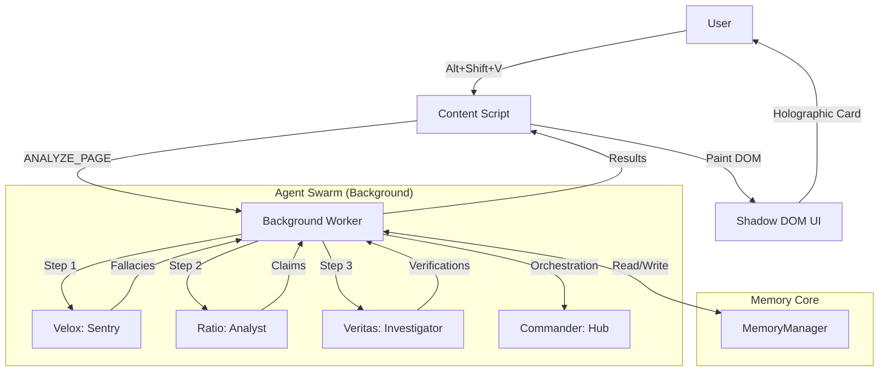

# Project VERITAS: The Digital Truth Lens
> *Veritas vincit omnia.* (Truth conquers all.)

**Project VERITAS** is a "Digital Brutalist" browser extension designed to restore trust and clarity to the web. It uses a swarm of specialized AI agents to analyze content in real-time, detecting logical fallacies, extracting factual claims, verifying information against the web, and visualizing the hidden structure of knowledge.

This guide is the definitive manual for Project VERITAS, covering everything from basic installation to advanced autonomous agent orchestration and deep internal mechanics.

---

## 🏗️ Philosophy & Design

### Digital Brutalism
Veritas rejects the "clean corporate" aesthetic of modern web design. It embraces **Digital Brutalism**:
*   **Raw Data**: Information is presented without sugar-coating.
*   **High Contrast**: Neon Cyan (#00F0FF) and Gold (#FFD700) against deep void Black (#050505).
*   **Monospace Typography**: Using `JetBrains Mono` to emphasize code-like precision.
*   **Function over Form**: Every pixel serves the purpose of revealing truth.

### The "Truth Lens" Concept
The web is full of noise, manipulation, and hidden agendas. Veritas acts as a lens that filters this out:
*   **Dimming the Noise**: Ads and low-value content are visually suppressed.
*   **Highlighting the Signal**: Facts and fallacies are illuminated.
*   **Connecting the Dots**: Isolated claims are woven into a knowledge graph.

### The "Neon Ritual" (Visual Mechanics)
The activation of Veritas is designed to feel like a ritual.
*   **The Halo**: When active, a `NeonHalo` component renders a breathing Cyan-to-Gold gradient border on a full-screen Canvas (`src/components/NeonHalo.tsx`).
*   **The Scanlines**: Subtle scanlines (opacity 0.05) overlay the screen to evoke CRT monitors and cyberpunk aesthetics.
*   **The Breathing**: The glow intensity oscillates using a sine wave function (`0.5 + Math.sin(phase) * 0.3`), creating the feeling that the system is "alive".

---

## ⚙️ Installation & Setup

### Prerequisites
*   **Node.js**: v18 or higher.
*   **pnpm**: Recommended package manager (or npm/yarn).
*   **Google Gemini API Key**: Required for agent intelligence.

### Quick Start
1.  **Clone the Repository**:
    ```bash
    git clone https://github.com/mqingcs/Project-VERITAS-The-Digital-Truth-Lens/tree/Final-version
    cd Project-VERITAS-The-Digital-Truth-Lens
    ```

2.  **Install Dependencies**:
    ```bash
    npm install
    ```

3.  **Run Development Server**:
    ```bash
    npm run build
    ```
    This will start the Plasmo development server and load the extension into Chrome automatically (if configured) or generate a `build/chrome-mv3-prod` folder to load manually.

4.  **Load in Chrome**:
    *   Go to `chrome://extensions`.
    *   Enable "Developer Mode".
    *   Click "Load Unpacked".
    *   Select the `build/chrome-mv3-prod` folder.

**Congratulations!** You have successfully installed Project VERITAS.

---

## 🚀 Basic Usage: The "Truth Scan"

### 1. Activating the System
Navigate to any article, news post, or social media feed you wish to analyze.
*   **Trigger**: Press `Alt + Shift + V` (or `option + Shift + V` on Mac).
*   **Visual Feedback**: The **Neon Halo**—a breathing Cyan/Gold border—will appear around your screen. This indicates the Agent Swarm is active.

### 2. The Analysis Pipeline (What You See)
Veritas processes the page in three visible layers:

*   **Layer 1: The Sentry (Velox)**
    *   *Effect*: The page may darken slightly as "Low Value" content (ads, sidebars) is dimmed.
    *   *Highlights*: **Blue** outlines appear around logical fallacies.
    *   *Meaning*: The system is flagging manipulation attempts and noise.

*   **Layer 2: The Analyst (Ratio)**
    *   *Effect*: Specific sentences and phrases are underlined.
    *   *Highlights*: **Cyan** underlines for factual claims.
    *   *Meaning*: The system has extracted testable facts from the text.

*   **Layer 3: The Investigator (Veritas)**
    *   *Effect*: The Cyan underlines change color based on verification.
    *   *Highlights*:
        *   **Green**: Verified Fact (Supported by multiple sources).
        *   **Red Strikethrough**: False/Debunked Claim (Contradicted by sources).
        *   **Yellow/Orange**: Disputed or Unverified (Mixed evidence).

### 3. The Analysis Pipeline (What You See)

When you click "ANALYZE", the system performs a "Deep Scan" of the page. The result is presented in the **Enhanced Holographic Card**, a draggable, interactive dashboard with **6 Specialized Tabs**:

#### Tab 1: OVERVIEW (The Dashboard)
*   **Risk Gauge**: A live, animated circular gauge showing the "Misinformation Risk Score" (0-100).
    *   **Green (<30)**: Safe.
    *   **Yellow (30-70)**: Caution.
    *   **Red (>70)**: High Risk.
*   **Executive Summary**: A concise, AI-generated summary of the page's core arguments and credibility.
*   **Quick Actions**: One-click buttons to "Ask Commander" or "View Graph".
*   **Status Badges**: Instant indicators for "FALSE CLAIMS", "FALLACIES DETECTED", or "VERIFIED FACTS".

#### Tab 2: FALLACIES (The Bullshit Detector)
*   **List View**: Displays every logical fallacy detected by Velox.
*   **Definitions**: Click "What is this?" to see the academic definition of the fallacy (e.g., *Ad Hominem*, *Strawman*).
*   **Severity**: Each fallacy is rated (LOW/MEDIUM/HIGH) based on its impact on the argument.

#### Tab 3: CLAIMS (The Fact Matrix)
*   **Atomic Extraction**: Lists every factual claim isolated by Ratio.
*   **Importance Bars**: Visual indicator of how central the claim is to the article's thesis.
*   **Entity Tags**: Shows key people/orgs mentioned in the claim (e.g., "WHO", "Elon Musk").
*   **"Verify This"**: A manual trigger button to force a Deep Dive on a specific claim.

#### Tab 4: VERIFICATION (The Truth Lens)
*   **Status Indicators**:
    *   ✅ **VERIFIED**: Confirmed by reliable sources.
    *   ❌ **FALSE**: Contradicted by evidence.
    *   ⚠️ **DISPUTED**: Sources disagree.
*   **Evidence Chain**: Displays the reasoning behind the verdict.
*   **Source Citations**: Direct links to the external evidence (gov, edu, org, etc.), color-coded by reliability.

#### Tab 5: GRAPH (The Mini-Map)
*   **Preview**: A small, interactive 2D force-directed graph of the current analysis.
*   **Filters**: Toggles to show/hide Claims, Entities, or Sources.
*   **Fullscreen Trigger**: A button to expand the graph into the immersive "God Mode" view.

#### Tab 6: COMMANDER (The Chat)
*   **Contextual Chat**: A dedicated chat window pre-loaded with the context of the *specific* card/element you are looking at.
*   **Suggested Questions**: AI-generated follow-up questions based on the analysis (e.g., *"Who is John Doe?"*, *"Explain the slippery slope fallacy"*).

---

## 🕸️ The Knowledge Graph (Visual Intelligence)

Veritas doesn't just read text; it builds a **Semantic Network**. The **Fullscreen Graph Modal** (`FullscreenGraphModal.tsx`) allows you to explore this network in 3D space.

### Core Mechanics
*   **Nodes**:
    *   🟡 **Claims** (Gold): The central assertions.
    *   🔵 **Entities** (Cyan): People, organizations, places.
    *   🟢 **Sources** (Green): External URLs and evidence.
*   **Edges**: The relationships (e.g., "Supports", "Contradicts", "Mentions").
*   **Physics**: Uses a force-directed algorithm (`d3-force`) where related nodes attract and unrelated ones repel.

### Advanced Interactions
*   **Focus Mode**: Double-click any node to isolate it and its immediate connections, fading out the rest of the graph.
*   **Smart Search**: Type in the search bar to instantly highlight matching nodes. Use `<` and `>` to cycle through matches.
*   **Type Filtering**: Toggle visibility of Claims, Entities, or Sources to reduce noise.
*   **Draggable Canvas**: Pan and zoom to explore massive datasets.

---

## 🧠 The Agent Swarm: Full Capabilities

Veritas is not a single AI; it is a coordinated swarm of four specialized agents.

### 🛡️ VELOX (The Sentry)
*   **Model**: Gemini 2.5 Flash-Lite (Optimized for speed).
*   **Role**: The first line of defense.
*   **Core Directive**: "Zero Tolerance for Manipulation."
*   **Capabilities**:
    *   **Noise Filtering**: Identifies ads, navigation, and boilerplate.
    *   **Fallacy Detection**: Recognizes 12+ types of fallacies including *Strawman*, *Gaslighting*, *Whataboutism*, and *False Equivalence*.
    *   **Emotional Severity Grading**: Assigns a severity score (Low/Medium/High) to emotional manipulation.

### ⚖️ RATIO (The Analyst)
*   **Model**: Gemini 2.5 Flash (Optimized for precision).
*   **Role**: The structured thinker.
*   **Core Directive**: "Extract, Do Not Judge."
*   **Capabilities**:
    *   **Fact Extraction**: Distinguishes objective claims from subjective opinions.
    *   **Entity Linking**: Identifies People, Organizations, Locations, and Events.
    *   **Temporal Extraction**: Understands time contexts (e.g., "last year", "in 2020").
    *   **Multilingual Processing**: Can process Chinese, English, Spanish, etc., while preserving the original language for search accuracy.

### 🔍 VERITAS (The Investigator)
*   **Model**: Gemini 2.5 Flash + Google Search Grounding.
*   **Role**: The truth seeker.
*   **Core Directive**: "Trust, but Verify."
*   **Capabilities**:
    *   **Live Web Verification**: Queries Google Search in real-time.
    *   **Source Credibility Analysis**: Evaluates sources based on domain authority (Gov/Edu > Major Media > Blogs).
    *   **Anti-Recitation Protocol**: Strictly forbidden from copying search snippets; must synthesize an answer.
    *   **Graph Construction**: Builds nodes (Claims, Entities) and edges (Supports, Contradicts) for the Knowledge Graph.

### 💬 COMMANDER (The Hub)
*   **Model**: Gemini 2.5 Flash.
*   **Role**: The orchestrator and user interface.
*   **Core Directive**: "Serve the User, Protect the Truth."
*   **Capabilities**:
    *   **Cognitive Protocol**: Determines if a user request requires a simple answer, a tool call, or a complex multi-step plan.
    *   **Autonomous Execution**: Can loop through "Thought -> Action -> Observation" cycles to solve complex problems.
    *   **DOM Control**: Can scroll, highlight, and manipulate the page to show you results.
    *   **Memory**: Remembers the context of the current page and your conversation.

---

## ⚡ Advanced Usage & "Amazing Things"

This section details power-user features and the "magic" capabilities of the system.

### 1. Autonomous Research Chains (The "Agent Loop")
Commander isn't just a chatbot; it's an agent that can *do* things. You can give it complex instructions that require multiple steps.

*   **Trigger**: `Alt + Shift + C` -> Type command.
*   **Example Command**: *"Find all claims about 'nuclear energy' on this page, verify them, and then summarize the three biggest misconceptions."*
*   **What Happens (The Chain)**:
    1.  **Plan**: Commander breaks this down: `Read Page` -> `Extract Claims (Topic: Nuclear)` -> `Verify Claims` -> `Synthesize Report`.
    2.  **Action 1**: Calls `read_page` tool.
    3.  **Action 2**: Calls `ratio` agent to extract specific claims.
    4.  **Action 3**: Calls `veritas` agent for the top 5 claims.
    5.  **Action 4**: Analyzes the verification results to find "False" or "Misleading" ones.
    6.  **Output**: Presents a final report in the chat window.

### 2. Cross-Lingual Forensics
Veritas excels at bridging language gaps to find the truth.

*   **Scenario**: You are reading a localized news report in **Chinese** that claims a specific event happened in **London**.
*   **Command**: *"Verify this event using English sources."*
*   **The Magic**:
    *   Ratio extracts the claim in Chinese.
    *   Veritas translates the core query to English.
    *   Veritas searches UK-based sources (BBC, Guardian).
    *   Veritas compares the facts and reports back in Chinese (or your preferred language), highlighting any discrepancies between the local report and the ground truth.

### 3. The "Bullshit Detector" (Visual Fallacy Mapping)
You can visually assess the credibility of an author without reading a word.

*   **Action**: Run the scan (`Alt+Shift+V`).
*   **Observation**: Open the **Fullscreen Graph** (`Card -> Graph -> Fullscreen`).
*   **Technique**: Look for **"Fallacy Clusters"**.
    *   If you see a dense web of *Blue* nodes (Fallacies) connecting to a specific *Entity* (e.g., a politician), it visually reveals a targeted smear campaign.
    *   If the graph is disconnected and sparse, the argument is weak and unstructured.
    *   If the graph has strong *Green* (Verified) backbones, the argument is solid.

### 4. "Deep Dive" Selection
Sometimes the automatic scan misses a subtle detail. You can force the agents to focus.

*   **Action**: Highlight a specific paragraph -> Right Click -> **"Veritas: Deep Dive"**.
*   **The Magic**: This triggers a focused, high-intensity analysis. Veritas will perform multiple search queries for *just that paragraph*, cross-referencing dates, names, and figures with much higher scrutiny than the full-page scan.

### 5. The "Cognitive Protocol" (Commander Modes)
Commander changes its behavior based on your intent. You can trigger these modes with your phrasing:

*   **Direct Execution Mode**: *"Highlight all mentions of 'Elon Musk' in red."* -> Commander immediately calls DOM tools.
*   **Analysis Mode**: *"Is this article biased?"* -> Commander reads the text and performs a sentiment/fallacy analysis.
*   **Creative Mode**: *"Rewrite this paragraph to be neutral."* -> Commander uses the extracted facts to reconstruct the text without the fallacies.

### 6. Agent Retasking & Correction
You can correct the agents if they make a mistake or get stuck.

*   **Scenario**: Commander fails to find a specific claim.
*   **Command**: *"You missed the claim in the second paragraph about the budget. Look again specifically at that section."*
*   **Mechanism**: Commander receives this as a "System Error" or "User Correction" in its history. It will re-plan, likely calling `get_page_text` again or `extract_claims` with a narrower focus.
*   **Power Move**: *"Forget the previous analysis. Start over with a focus on 'economic impact'."* -> This forces a context reset in the agent's planning loop.

---

## 🔬 Deep Dive: The Neural Architecture

This section explains the internal mechanisms that make Veritas "think".

### 1. The Dual-Layer Memory System (`memory.ts`)
Veritas uses a sophisticated memory architecture to handle the limited context window of LLMs while preserving data fidelity.

*   **The Problem**: Sending the full text of a webpage + 50 extracted claims + 20 search results to the LLM for every decision would crash the browser or cost a fortune.
*   **The Solution**: **Compression vs. Retrieval**.
    *   **Layer A: The Context Index (Compressed)**:
        *   When an agent finishes a task (e.g., `extract_claims`), it stores a *summary* in the active context.
        *   *Example*: "Found 15 claims. Top 3: [Claim A], [Claim B], [Claim C]."
        *   Commander sees this summary to make decisions ("Okay, I should verify Claim A").
    *   **Layer B: The Deep Storage (Raw)**:
        *   The *full* JSON object (with XPaths, Element IDs, and every single word) is stored in the `MemoryManager` but *hidden* from the LLM's immediate view.
    *   **The Bridge**: When Commander decides to act (e.g., "Highlight Claim A"), it calls the `read_memory` tool. This tool fetches the *Raw* data from Deep Storage, allowing Commander to access the specific `elementId` needed to paint the DOM.

### 2. The Autonomous Executor Loop (`autonomous-executor.ts`)
Commander operates on a "ReAct" (Reasoning + Acting) loop, but with a twist: **Asynchronous DOM Binding**.

*   **Cycle**:
    1.  **Observe**: Commander reads the `state.history` and `memory.getExecutionContext()`.
    2.  **Think**: It formulates a plan (e.g., "I need to search for X").
    3.  **Act**: It emits a `toolCall` (e.g., `search("X")`).
    4.  **Wait**: The `AutonomousExecutor` pauses Commander. It executes the tool (which might involve async network calls or DOM scraping).
    5.  **Feedback**: The result is fed back into `state.history`.
    6.  **Loop**: Commander wakes up, sees the result, and decides the next step.
*   **Safety**: The loop has a hard limit of 20 iterations to prevent infinite "thought spirals".

### 3. The "Anti-Recitation" Protocol
To prevent the AI from simply copying search results (which causes copyright issues and hallucinations), Veritas enforces a strict protocol in `veritas.ts` and `search.ts`.

*   **Mechanism**:
    *   The prompt explicitly forbids "verbatim recitation".
    *   If the Google Gemini API detects recitation, it throws a specific error code.
    *   **Auto-Retry**: The system catches this error and re-prompts the model: *"You triggered the recitation filter. Rewrite your answer to synthesize the information instead of copying it."*

### 4. The 5-Layer Fuzzy Matching Engine (`fuzzy-text-matcher.ts`)
The web is dynamic. The text you analyzed 5 seconds ago might have moved 2 pixels or changed a CSS class. Veritas uses a robust, 5-layer strategy to ensure highlights "stick" with 100% accuracy.

*   **Strategy 1: Exact Match**: Fast and perfect.
*   **Strategy 2: Normalized Exact Match**: Ignores whitespace and special quote characters.
*   **Strategy 3: Best Substring Match**: Uses a sliding window to find the best matching chunk if the text was partially edited.
*   **Strategy 4: Partial N-Gram Match**: Breaks text into 15-character chunks and finds them scattered in the paragraph.
*   **Strategy 5: Anchored Match**: Finds the first and last words of the sentence and highlights everything in between.

### 5. The "Oceanic" Data Protocol (`agents.ts`)
The agents communicate using strict, typed JSON schemas to ensure reliability.

*   **Velox Output (`RawAnalysisMap`)**:
    *   `lowValueNodes`: List of ads/noise with `elementId`.
    *   `fallacyNodes`: List of logical errors with `severity` (low/medium/high) and `explanation`.
*   **Ratio Output (`FactJSON`)**:
    *   `claims`: The core unit. Contains `text`, `importance` (0-1), and `entities` (linked IDs).
    *   `entities`: People/Orgs with `mentions` (XPaths).
*   **Veritas Output (`VerifiedGraphData`)**:
    *   `verifications`: Status (`verified`, `false`, `disputed`), `confidence`, and `evidence` (sources).
    *   `graph`: Nodes and Edges for visualization.

---

## 🛠️ Technical Architecture

### System Diagram


### Data Flow Pipeline
1.  **Extraction**: `content-extractor.ts` scrapes the DOM, creating a simplified node tree to save tokens.
2.  **Analysis**: The `AutonomousExecutor` in the background manages the agent chain. It ensures that Ratio waits for Velox, and Veritas waits for Ratio.
3.  **Storage**: Results are stored in `MemoryManager` (`src/lib/memory.ts`), which uses compression to keep the context window efficient.
4.  **Painting**: `dom-painter.ts` receives the data. It uses **Fuzzy XPath Matching** (`xpath-utils.ts`) to find the correct elements to highlight, even if the page has slightly changed since extraction.

### File Structure
```
src/
├── agents/             # The AI Brains
│   ├── velox.ts        # The Sentry (Fallacies)
│   ├── ratio.ts        # The Analyst (Claims)
│   ├── veritas.ts      # The Investigator (Verification)
│   ├── commander.ts    # The Orchestrator (Chat/Planning)
│   └── search.ts       # General Search Tool
├── background/         # Service Worker
│   └── index.ts        # Message Routing & Pipeline Control
├── components/         # React UI Components
│   ├── EnhancedHolographicCard.tsx
│   ├── FullscreenGraphModal.tsx
│   ├── CommanderPanel.tsx
│   └── ...
├── contents/           # Content Scripts
│   └── cursor.tsx      # Main Injection Script
├── lib/                # Utilities
│   ├── autonomous-executor.ts # The Agent Loop Engine
│   ├── memory.ts       # Context Management
│   ├── dom-painter.ts  # Visual Manipulation
│   └── ...
└── store/              # State Management (Zustand)
```

---

## 🔧 Troubleshooting & Error Handling

### Common Issues

#### 1. "API Key Missing" or "Quota Exceeded"
*   **Symptom**: The Neon Halo appears but immediately turns red or disappears. Console shows 403/401 errors.
*   **Fix**: Check your `.env` file. Ensure `PLASMO_PUBLIC_GEMINI_API_KEY` is set. If utilizing the free tier of Gemini, you may have hit the rate limit (RPM). Wait a minute and try again.

#### 2. "RECITATION" Error (Safety Block)
*   **Symptom**: Veritas fails to verify a claim, and logs show `Finish Reason: RECITATION`.
*   **Cause**: The AI tried to copy a search result verbatim, triggering Google's anti-plagiarism filter.
*   **System Response**: The system is designed to catch this. It will automatically retry with a stricter "Rewrite/Synthesize" prompt. If it fails twice, it will mark the claim as "Unverifiable (Safety Block)".

#### 3. "Element Not Found" / Highlights Not Appearing
*   **Symptom**: The analysis completes (Status: "Complete"), but no highlights appear on the text.
*   **Cause**: The webpage uses a highly dynamic framework (like React/Vue) that re-rendered the DOM *after* Veritas extracted the text.
*   **Fix**:
    *   Veritas uses **Fuzzy Matching**, so it tolerates *some* change.
    *   If it fails completely, try scrolling the relevant text into view and running the scan again.
    *   Use the **Deep Dive** feature on the specific text, as this grabs a fresh snapshot of the DOM.

#### 4. Extension Connection Lost
*   **Symptom**: "Extension context invalidated" in the console.
*   **Cause**: The extension was updated or reloaded while the page was open.
*   **Fix**: Refresh the webpage. The content script needs to re-inject.

### Debugging Mode
To see exactly what the agents are thinking:
1.  Open Chrome DevTools (`F12`).
2.  Go to the **Console** tab.
3.  Filter for `[VERITAS]` or `[COMMANDER]`.
4.  You will see the raw "Thought" chains:
    *   `[COMMANDER] Plan: Read -> Verify -> Report`
    *   `[VELOX] Detected Fallacy: Ad Hominem (Confidence: High)`

---

## 📜 License & Credits
Project VERITAS is open-source software.
*   **Core**: Plasmo + React + TypeScript.
*   **Intelligence**: Google Gemini 2.5.
*   **Visualization**: React Force Graph.

> *In a world of noise, be the signal.*

---

# PART II: THE ATOMIC MECHANICS
> *Detailed analysis of the internal cognitive architectures and physics engines.*

This section is for developers and power users who want to understand the "soul" of the machine.

## 🧠 Cognitive Architectures (The Prompts)

The intelligence of Veritas is not just in the models, but in the **System Prompts** that govern them. These prompts act as the "Cognitive Operating System" for each agent.

### 1. RATIO: The Entropy Reducer
Ratio is designed to be a "Precision Instrument". Its prompt (`src/agents/ratio.ts`) enforces three critical protocols:

*   **Protocol A: "Extract, Do Not Judge"**
    *   *Directive*: "Your ONLY job is to EXTRACT claims, NOT to evaluate their truthfulness."
    *   *Reasoning*: If Ratio filters out "false" claims, Veritas never gets a chance to debunk them. Ratio must pass *everything* that looks like a claim, even "The moon is made of cheese", so Veritas can mark it as **FALSE**.
*   **Protocol B: Language Preservation**
    *   *Directive*: "If input is Chinese, output Chinese. If English, output English."
    *   *Reasoning*: Translating a claim *before* verification destroys the search keywords. To verify a Chinese news report, we must search for the original Chinese phrases.
*   **Protocol C: Strict JSON Enforcement**
    *   *Directive*: "Maximum 15 claims. Maximum 15 entities."
    *   *Reasoning*: Prevents context overflow and ensures the agent prioritizes the most important facts ("Entropy Reduction").

### 2. VERITAS: The Arbiter
Veritas is the "Judge". Its architecture (`src/agents/veritas.ts`) is built around **Search Grounding** and **Anti-Recitation**.

*   **Protocol A: The "Anti-Recitation" Firewall**
    *   *Problem*: LLMs love to copy-paste search results, which triggers Google's "Recitation" safety filter, blocking the response.
    *   *Solution*: The prompt explicitly commands: *"Read the search results, understand the facts, and then write the answer completely in your own words."*
    *   *Fallback*: If the API returns `FinishReason: RECITATION`, the system catches the error and auto-retries with a stricter "Rewrite" prompt.
*   **Protocol B: Positional ID Mapping**
    *   *Problem*: The LLM often forgets the complex IDs (e.g., `claim-12`) and returns generic ones (`claim-1`).
    *   *Solution*: The code uses a **3-Stage Mapping Strategy**:
        1.  **Exact Match**: Check if the returned ID exists.
        2.  **Positional Match**: Assume the 1st verification corresponds to the 1st claim sent.
        3.  **Fuzzy Text Match**: Compare the text of the verification to the original claim.
*   **Protocol C: Direct Verification**
    *   *Optimization*: If a claim is a basic scientific fact ("Water is H2O"), Veritas is instructed to skip the web search and verify it directly with `Confidence: 1.0`.

---

## 🌐 The Synaptic Web (Global State)

Veritas uses a "Central Nervous System" built on **Zustand** and **Chrome Storage** (`src/store/index.ts`).

### 1. Cross-Context Synchronization
The extension runs in three separate worlds:
1.  **Content Script** (The webpage)
2.  **Side Panel** (The UI)
3.  **Background Worker** (The Brain)

To keep them in sync, the store uses a **Bridge Pattern**:
*   **Write**: When you update state (e.g., `setHaloActive(true)`), it saves to `chrome.storage.local`.
*   **Listen**: All contexts listen to `chrome.storage.onChanged`.
*   **Sync**: When the storage changes, the other contexts automatically update their local Zustand store. This creates the illusion of a single, unified application.

### 2. The "Force Stop" Circuit Breaker
If the agents get stuck in a loop, the user can hit "STOP". This triggers a hard kill:
*   **Action**: `forceStop()`
*   **Effect**:
    1.  Clears the UI state immediately.
    2.  Sends a `FORCE_STOP` message to the Background Worker.
    3.  The `AutonomousExecutor` checks this flag before every step and aborts execution instantly if set.

---

## ⚛️ Holographic UI Physics

The interface is not just "styled"; it is **simulated**.

### 1. The "Neon Ritual" (Breathing Math)
The `NeonHalo` component (`src/components/NeonHalo.tsx`) uses a sine wave to calculate opacity in real-time (60fps):
```typescript
const opacity = 0.5 + Math.sin(Date.now() / 1000) * 0.3;
```
This creates a "breathing" effect that feels organic, implying the AI is "alive" and thinking.

### 2. The Risk Gauge
The circular gauge on the Holographic Card (`EnhancedHolographicCard.tsx`) is drawn using SVG math:
*   **Circumference**: `2 * PI * r`
*   **Dash Offset**: `circumference - (score / 100) * circumference`
This allows the gauge to animate smoothly from 0 to the calculated risk score.

### 3. The Glitch Effect
To reinforce the "Digital Brutalist" aesthetic, the card has a random glitch trigger:
*   **Logic**: Every 10 seconds, there is a 30% chance to trigger a CSS `glitch` animation for 300ms.
*   **Effect**: The card momentarily distorts, simulating a signal interference or a "cyberpunk" data stream.

---

## 🛡️ Resilience Protocols (Self-Healing Code)

Veritas assumes the AI will fail. The system is built to recover automatically.

### 1. The 4-Stage JSON Recovery (`json-parser.ts`)
LLMs often output broken JSON. Veritas uses a custom parser that attempts to fix it in four stages:
1.  **Direct Parse**: Try `JSON.parse()`.
2.  **Cleaned Parse**: Strip Markdown code fences (` ```json `).
3.  **Advanced Recovery**: Fix common syntax errors (e.g., unescaped quotes, trailing commas).
4.  **Truncation Recovery**: If the token limit cut off the response, the parser tracks bracket depth (`{` vs `}`) to find the last valid complete object and discards the broken tail.

### 2. The "Mock Data" Circuit
If the API fails completely (Timeout, 500 Error, Quota Exceeded), the agents don't crash.
*   **Mechanism**: Each agent has a `getMockData()` fallback function.
*   **Result**: The UI continues to function with placeholder data, allowing the user to inspect the interface even when the brain is offline.

---

# PART III: THE COMMANDER'S HANDBOOK
> *How to pilot the machine. A manual for the autonomous engine.*

Commander is not a chatbot. It is a **Cybernetic Orchestrator** that wields the other agents as tools. To use it effectively, you must understand its "Cognitive Protocol".

## 🗣️ The Syntax of Command

Commander classifies your requests into three types (`src/agents/commander.ts`). Knowing this helps you get the result you want.

### Type A: Direct Execution (The "Soldier" Mode)
*   **Intent**: You want a specific tool run immediately.
*   **Trigger Phrases**: "Highlight...", "Show...", "List...", "Read..."
*   **Example**: *"Highlight all fallacies in red."*
*   **System Response**: Commander skips the planning phase and immediately calls `analyze_fallacies` -> `highlight_element`.
*   **Best For**: Quick visual feedback.

### Type B: Goal-Oriented (The "General" Mode)
*   **Intent**: You have a high-level objective but don't care how it's done.
*   **Trigger Phrases**: "Verify...", "Investigate...", "Is this true?", "Analyze..."
*   **Example**: *"Is the claim about the budget deficit true?"*
*   **System Response**: Commander enters **Autonomous Mode**.
    1.  **Plan**: "I need to find the claim first." -> `extract_claims`
    2.  **Refine**: "Found 3 claims about budget. I'll verify the specific one." -> `deep_dive`
    3.  **Report**: "The claim is FALSE based on Treasury data." -> `show_result_window`
*   **Best For**: Complex research tasks.

### Type C: Contextual (The "Partner" Mode)
*   **Intent**: You are referring to something on the screen or in previous chat.
*   **Trigger Phrases**: "What about that one?", "Why is it false?", "Dig deeper."
*   **Example**: (After a scan) *"Why is the second claim marked false?"*
*   **System Response**: Commander reads the `Memory Index`, retrieves the specific `verification` result for "Claim #2", and explains the reasoning.

## 🛠️ The Toolbelt (User Edition)

Commander has access to a specialized arsenal. You can invoke these by name or intent.

| Tool | Trigger | Description |
| :--- | :--- | :--- |
| **Deep Dive** | "Verify this", "Check sources" | Triggers Veritas to perform a multi-query Google Search on a specific text. |
| **Fallacy Scan** | "Find logic errors", "Is this biased?" | Triggers Velox to scan for 12+ types of logical fallacies. |
| **Claim Extraction** | "List facts", "What are the key points?" | Triggers Ratio to extract atomic claims and entities. |
| **Highlight** | "Mark in red", "Show me where" | Uses **Fuzzy XPath** to paint the DOM. 100% accuracy even if text moves. |
| **Memory Read** | "What did you find?", "Summarize" | Accesses the hidden JSON state of previous agents. |

## ⚡ "God Mode" Workflows

These are advanced command chains that leverage the full power of the swarm.

### 1. The "Cross-Examination"
*   **Command**: *"Find all contradictions between this article and the official WHO report on this topic."*
*   **The Chain**:
    1.  Commander reads the page.
    2.  Extracts claims about health/medical topics.
    3.  Runs a `deep_dive` with a specific query: `site:who.int [claim keywords]`.
    4.  Synthesizes a report highlighting where the article deviates from the official source.

### 2. The "Visualizer"
*   **Command**: *"Highlight verified facts in green and fallacies in red."*
*   **The Chain**:
    1.  Calls `extract_claims` -> `verify_claims`.
    2.  Calls `analyze_fallacies`.
    3.  Iterates through results:
        *   If `status === 'verified'`, call `highlight_claim(color: 'green')`.
        *   If `fallacy`, call `highlight_element(color: 'red')`.
    4.  The page transforms into a heat map of truth.

### 3. The "Entity Profiler"
*   **Command**: *"Who is 'John Doe' mentioned in the text and is he credible?"*
*   **The Chain**:
    1.  Calls `extract_claims` to find the entity "John Doe".
    2.  Runs a background check search (`"John Doe reputation credentials"`).
    3.  Returns a dossier summarizing his background and potential biases.

## 🎮 Agent Retasking (Correction)

Even the Swarm makes mistakes. You can correct them in real-time.

*   **Scenario**: Commander highlights the wrong paragraph.
*   **Command**: *"No, I meant the paragraph below that one, about the tax cuts."*
*   **Mechanism**:
    1.  Commander receives the error feedback.
    2.  It re-reads the `get_page_text` output.
    3.  It performs a **Fuzzy Text Match** for "tax cuts" near the previous location.
    4.  It re-executes the highlight on the correct node.

*   **Scenario**: Veritas fails to verify a claim.
*   **Command**: *"Try searching for '2023 fiscal report' instead."*
*   **Mechanism**:
    1.  Commander manually triggers `deep_dive` with the *user-provided* query.
    2.  This overrides the agent's internal query generation logic.

---

## 🛑 The "Kill Switch"

If Commander gets stuck in a loop or you want to cancel a long research task:
*   **Action**: Click the **"STOP"** button in the Commander Panel.
*   **Command**: Type *"Stop"* or *"Cancel"*.
*   **Effect**: The `AutonomousExecutor` immediately terminates the loop (`isRunning = false`), clears the task queue, and resets the agent status to "Idle".
